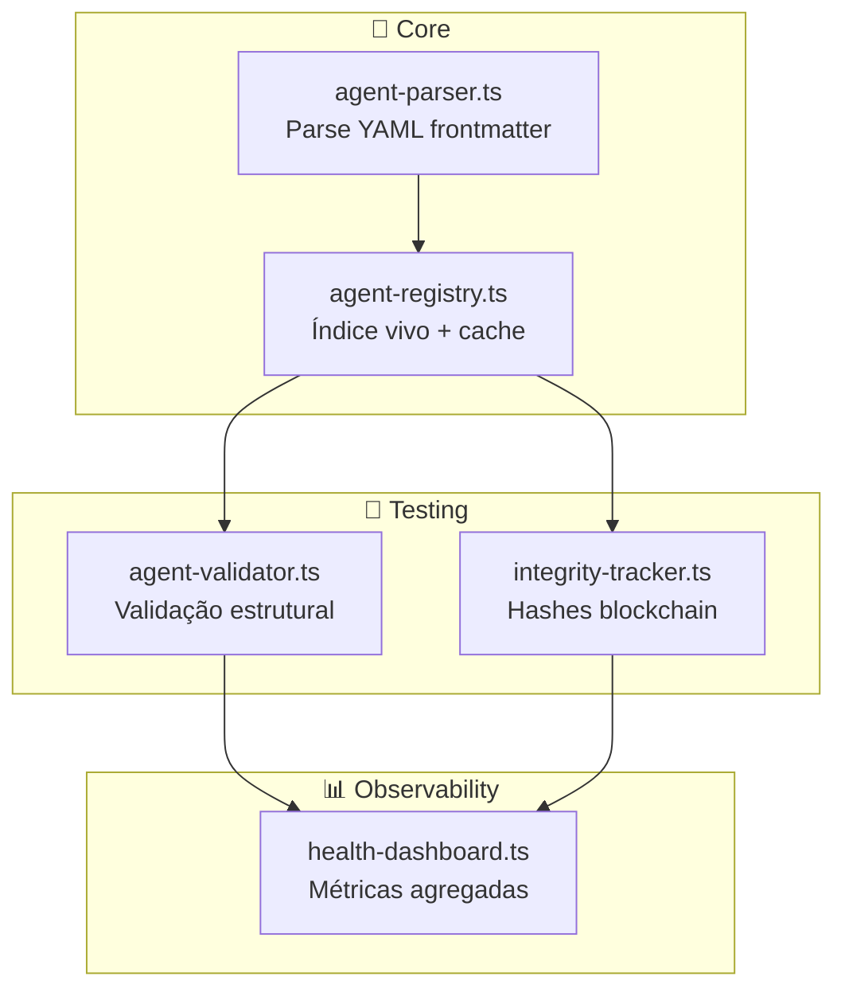

# 🧪 Agent Test — Sistema de Testes do Ecossistema

> *"Um sistema de agents sem testes é um sistema morto. Testes dão vida ao ecossistema."*

---

## Comandos Disponíveis

### Quick Health Check

```bash
npm run agents:health
```

Exibe registro de todos os agents com estatísticas básicas.

### Full Health Dashboard

```bash
npx tsx lib/agents/health-dashboard.ts
```

Relatório completo com:
- Score de saúde (0-100)
- Métricas de validação
- Status da cadeia de integridade
- Status do Graphiti
- Recomendações

### Validação Estrutural

```bash
npx tsx lib/agents/agent-validator.ts
```

Valida:
- Frontmatter completo
- Referências válidas
- Integração com Graphiti
- Cadeia de escalação

### Integridade (Blockchain-like)

```bash
npx tsx lib/agents/integrity-tracker.ts
```

Rastreia mudanças com hashes encadeados e detecta tampering.

### Testes Automatizados

```bash
npm run agents:test
```

Roda suite de testes Jest para o módulo de agents.

---

## Interpretação do Score

| Score | Status | Ação |
|-------|--------|------|
| 90-100 | 🟢 Healthy | Nenhuma ação necessária |
| 70-89 | 🟡 Degraded | Revisar warnings |
| 0-69 | 🔴 Critical | Correção urgente |

---

## Quando Usar

| Situação | Comando |
|----------|---------|
| Início de sessão | `npm run agents:health` |
| Antes de commit | `npm run agents:test` |
| Auditoria semanal | Health Dashboard completo |
| Após criar/modificar agent | Validação + Integridade |
| Suspeita de tampering | Integrity Tracker |

---

## Arquitetura do Sistema



---

## Regras de Validação

### Frontmatter Obrigatório

```yaml
type: agent          # ou workflow, meta-agent
inherits: _DNA.md    # para agents
escalates-to: X      # hierarquia de escalação
```

### Colaborações Bidirecionais

Se Agent A declara colaboração com B, idealmente B menciona A.

### Integração com Graphiti

Agents devem mencionar CONHECIMENTO ou Graphiti para memória persistente.

---

## Integração CI/CD

Adicione ao GitHub Actions:

```yaml
- name: Agent Health Check
  run: |
    npm run agents:test
    npx tsx lib/agents/agent-validator.ts
```

---

```yaml
@workflow-links:
  - /auditoria: Prompt para auditoria completa
  - /manutencao: Manutenção crítica do ecossistema
  - /verificacao: Verificação antes de conclusão
@collaborates:
  - CONHECIMENTO: Persistir resultados de health-check
  - CODIGO: Manutenção do código de testes
  - CONSISTENCIA: Validação de integridade
@created: 2025-12-31
@last-verified: 2025-12-31
```
