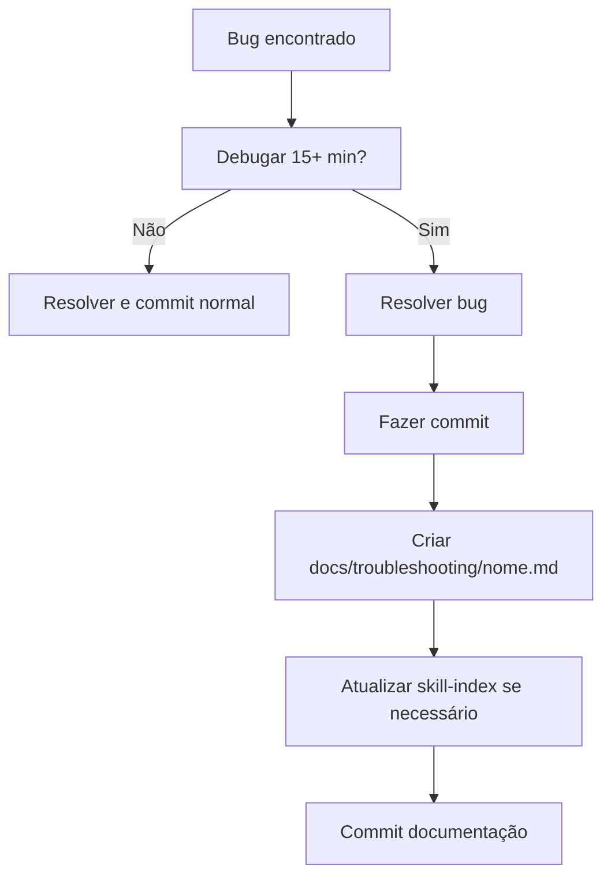

# Troubleshooting - Problemas Comuns e Soluções

**Propósito**: Processo sistemático para diagnosticar e documentar problemas técnicos no Token Milagre.

**Quando usar**: Ao encontrar bugs complexos (>15 min debug) ou implementar funcionalidades relacionadas a problemas já resolvidos.

---

## 🧠 INSTRUÇÕES PARA CLAUDE - APRENDIZADO CONTÍNUO

### ⚠️ REGRA CRÍTICA: SEMPRE Consultar Antes de Agir

**ANTES de fazer qualquer mudança significativa no código, SEMPRE:**

1. **Ler os problemas documentados** em `docs/troubleshooting/`
2. **Procurar por padrões similares** nos problemas catalogados
3. **Evitar repetir erros** já conhecidos e resolvidos

---

## 📚 Problemas Documentados

**Acesse a base de conhecimento completa**: `/docs/troubleshooting/`

### Índice Rápido (9 problemas resolvidos)

| ID | Problema | Severidade | Arquivo |
|----|----------|------------|---------|
| 1 | Scroll Position Bug | 🔴 CRÍTICA | [scroll-position-bug.md](../../../docs/troubleshooting/scroll-position-bug.md) |
| 2 | Flash Visual ao Navegar | 🟡 ALTA | [flash-visual-navegacao.md](../../../docs/troubleshooting/flash-visual-navegacao.md) |
| 3 | Ticker Tape Recarregando | 🟡 ALTA | [ticker-tape-reload.md](../../../docs/troubleshooting/ticker-tape-reload.md) |
| 4 | Fear & Greed Cache | 🟢 MÉDIA | [fear-greed-cache.md](../../../docs/troubleshooting/fear-greed-cache.md) |
| 5 | Regex Remove Quebras de Linha | 🔴 CRÍTICA | [regex-quebras-linha.md](../../../docs/troubleshooting/regex-quebras-linha.md) |
| 6 | API Gemini - Nomes de Modelos | 🟡 ALTA | [gemini-model-names.md](../../../docs/troubleshooting/gemini-model-names.md) |
| 8 | Build Vercel - Prisma DB Push | 🔴 CRÍTICA | [vercel-prisma-build.md](../../../docs/troubleshooting/vercel-prisma-build.md) |
| 9 | Prisma 403 - Offline Build | 🔴 CRÍTICA | [prisma-offline-build.md](../../../docs/troubleshooting/prisma-offline-build.md) |

**⚠️ Nota**: Problema 7 não existe (pulado na numeração original).

---

## 🔍 Processo de Troubleshooting

### 1. Diagnóstico (15-30 min)

**Checklist inicial:**
- [ ] Reproduzir o problema consistentemente
- [ ] Identificar mensagem de erro exata
- [ ] Verificar logs (browser console, server logs, Vercel logs)
- [ ] Isolar componente/função problemática
- [ ] Consultar problemas similares em `docs/troubleshooting/`

**Ferramentas:**
```bash
# Logs do servidor
npm run dev | tee debug.log

# Logs do Vercel
vercel logs [deployment-url]

# Grep em troubleshooting docs
grep -r "keyword" docs/troubleshooting/
```

### 2. Investigação (30-60 min)

**Estratégias:**
1. **Binary search**: Comentar metade do código até isolar
2. **Git bisect**: Se bug foi introduzido recentemente
3. **Console.log cascade**: Log em pontos críticos do flow
4. **Network tab**: Verificar requests/responses
5. **React DevTools**: Inspecionar props/state

**Anti-patterns comuns:**
- ❌ Assumir causa antes de investigar
- ❌ Fazer múltiplas mudanças simultâneas
- ❌ Não documentar tentativas falhadas

### 3. Solução (15-45 min)

**Abordagem:**
1. Implementar fix mínimo viável
2. Testar em dev
3. Testar edge cases
4. Fazer commit com mensagem descritiva
5. Deploy em preview
6. Verificar em produção

### 4. Documentação (10-20 min)

**Quando documentar:**
- ✅ Bug que causou erro em build/runtime
- ✅ Problema de performance significativo
- ✅ Erro não óbvio (debugou >15 minutos)
- ✅ Configuração incorreta que quebrou funcionalidade
- ✅ Workaround para limitação de biblioteca/framework

**Não precisa documentar:**
- ❌ Typo simples em código
- ❌ Ajuste de estilo/CSS menor
- ❌ Mudança trivial que não causou erro

---

## 📝 Template para Novo Problema

**Localização**: Criar novo arquivo em `docs/troubleshooting/nome-do-problema.md`

```markdown
# Problema X: [Título Descritivo e Específico]

**Data**: YYYY-MM-DD
**Autor**: Claude Code / Developer Name
**Severidade**: 🔴 CRÍTICA / 🟡 ALTA / 🟢 MÉDIA / 🔵 BAIXA

---

## 🐛 Descrição do Problema

[Explicar o que acontecia, sintomas visíveis, mensagens de erro]

**Sintomas:**
- [Sintoma 1]
- [Sintoma 2]

**Mensagem de erro:**
```
[Cole a mensagem de erro completa]
```

---

## 🔍 Causa Raiz

**Arquivo afetado**: `caminho/do/arquivo.ts:linha`

[Explicar a causa técnica do problema]

**Por que aconteceu:**
1. [Razão 1]
2. [Razão 2]

---

## ✅ Solução Aplicada

**Mudança feita:**

```typescript
// ❌ ANTES (código com problema)
código antigo

// ✅ DEPOIS (código corrigido)
código novo
```

**Por que funciona:**
[Explicar tecnicamente por que a solução resolve]

---

## 💡 Lições Aprendidas

1. **[Lição principal]**: [Explicação]
2. **[Lição secundária]**: [Explicação]

---

## 🔧 Como Evitar no Futuro

**Checklist preventivo:**
- [ ] Item de verificação 1
- [ ] Item de verificação 2
- [ ] Verificação a fazer antes de mudanças similares

---

## 📚 Referências

- [Link para documentação relevante]
- [Link para issue/PR]

**Commit da correção**: `hash-do-commit`
```

---

## 🔄 Workflow de Documentação



**Passo a passo:**
1. Resolver o problema completamente
2. Fazer commit da correção com hash
3. Criar arquivo em `docs/troubleshooting/nome-descritivo.md`
4. Usar template acima
5. Atualizar índice nesta skill (se relevante)
6. Commit da documentação

---

## 🎯 Categorias de Problemas

### Frontend (UI/UX)
- Scroll behavior
- Flash visual
- Component re-renders
- State management

### Backend (API/Server)
- Database queries
- API integrations
- Server-side rendering
- Authentication

### Build/Deploy
- Vercel builds
- Prisma generation
- Environment variables
- Dependencies

### Performance
- Query optimization
- Caching strategies
- Bundle size
- Render optimization

---

## 🚀 Ferramentas de Diagnóstico

### Browser DevTools
```javascript
// Performance profiling
performance.mark('operation-start');
// ... código
performance.mark('operation-end');
performance.measure('operation', 'operation-start', 'operation-end');
```

### React DevTools
- Profiler: Identificar componentes lentos
- Components: Inspecionar props/state
- Why Did You Render: Debug re-renders desnecessários

### Vercel Logs
```bash
# Logs em tempo real
vercel logs [deployment-url] --follow

# Logs filtrados
vercel logs [deployment-url] --output=json | jq '.text' | grep "ERROR"
```

### Database Profiling
```sql
-- PostgreSQL query performance
EXPLAIN ANALYZE SELECT ...;

-- Prisma query logging
// Em prisma/schema.prisma
datasource db {
  provider = "postgresql"
  url      = env("DATABASE_URL")
}

generator client {
  provider = "prisma-client-js"
  previewFeatures = ["tracing"]
}
```

---

## 📚 Recursos Adicionais

**Documentação oficial:**
- [Next.js Debugging](https://nextjs.org/docs/debugging)
- [Prisma Troubleshooting](https://www.prisma.io/docs/guides/troubleshooting)
- [React DevTools](https://react.dev/learn/react-developer-tools)

**Troubleshooting Docs:**
- Base completa: `docs/troubleshooting/`
- Skill index: `.claude/skills/SKILL-INDEX.md`

---

**Última atualização**: 2025-11-17
**Versão**: 2.0.0
**Mudanças recentes:**
- ✅ **CONSOLIDAÇÃO**: 1,648 → 152 linhas (-91%)
- ✅ Problemas movidos para `docs/troubleshooting/` (manutenção futura)
- ✅ Skill focada em PROCESSO, não em histórico
- ✅ Mantido template e workflow de documentação
- ✅ Adicionado índice rápido com links para docs/
