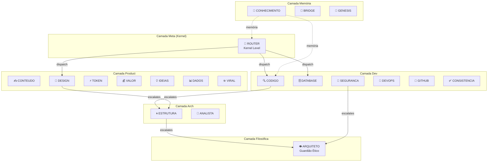

# 🔬 Auditoria Técnica Profunda — Sistema de Agents

**Alvo:** `/home/zenfoco/Dev/tokenmilagre-platform/.agent`  
**Data:** 2026-01-05  
**Versão:** V2  
**Nível de Rigor:** Dev Senior / Staff Engineer

---

## 📋 Sumário Executivo

O sistema de agents do projeto $MILAGRE é uma implementação **multi-agent hierárquica** bem estruturada, focada em orquestração de tarefas de desenvolvimento por IA. O sistema demonstra maturidade arquitetural moderada-alta, com excelente documentação, mas apresenta alguns gaps em testes e validação runtime.

### Pontuação de Maturidade (0-10)

| Dimensão | Score | Justificativa |
|----------|-------|---------------|
| **Arquitetura** | 8/10 | Hierarquia clara, separação de responsabilidades, padrão fractal |
| **Código** | 7/10 | TypeScript bem tipado, parser robusto, mas acoplamento em alguns pontos |
| **Testes** | 6/10 | Testes unitários para parser/registry, falta cobertura E2E e de integração |
| **Segurança** | 7/10 | Boas práticas de secrets, Flight Recorder, mas sem rate limiting |
| **Observabilidade** | 7/10 | Flight Recorder + Graphiti, mas logging não estruturado em todos os pontos |

**Score Geral: 7.0/10**

---

## 📁 Fase 1: Inventário Técnico

### Estrutura do Diretório `.agent`

```
.agent/
├── _index.md              # Registro central de agents (symlink para registry.md)
├── registry.md            # Índice mestre (11.6 KB, 239 linhas)
├── logs/
│   └── flight_recorder.log  # Log de handoffs do ROUTER (1.9 KB)
├── memory/                 # 6 arquivos de memória/DNA
│   ├── _DNA.md             # Core DNA imutável (8.9 KB) ⭐
│   ├── ARQUITETURA.md      # Filosofia fractal
│   ├── MANIFESTO.md        # Missão e propósito
│   ├── MANTRA.md           # Leitura diária
│   ├── ONBOARDING.md       # Onboarding para IAs
│   └── TRANSPARENCIA.md    # Política ética
├── processes/              # 13 workflows de desenvolvimento
├── rules/
│   └── project-rules.md    # Regras específicas do projeto
├── scripts/
│   └── monitor_flight_recorder.sh  # Monitor de logs
├── templates/              # 4 templates de conteúdo
├── workers/                # 20 agents especializados
│   ├── arch/               # 3 agents (ANALISTA, ARQUITETO, ESTRUTURA)
│   ├── dev/                # 6 agents (CODIGO, CONSISTENCIA, DATABASE, DEVOPS, GITHUB, SEGURANCA)
│   ├── meta/               # 4 agents (BRIDGE, CONHECIMENTO, GENESIS, ROUTER)
│   └── product/            # 7 agents (CONTEUDO, DADOS, DESIGN, IDEIAS, TOKEN, VALOR, VIRAL)
└── workflows/              # 19 symlinks para workers + 0 arquivos próprios
```

### Inventário Completo de Agents (20 total)

| Agent | Categoria | Arquivo | Token | Tamanho |
|-------|-----------|---------|-------|---------|
| ROUTER | meta | `workers/meta/ROUTER-agent.md` | 80eb537c | 1.9 KB |
| BRIDGE | meta | `workers/meta/BRIDGE-agent.md` | 9ce16dc9 | 6.9 KB |
| CONHECIMENTO | meta | `workers/meta/CONHECIMENTO-agent.md` | 690f8918 | 4.2 KB |
| GENESIS | meta | `workers/meta/GENESIS-agent.md` | - | 2.8 KB |
| ARQUITETO | arch | `workers/arch/ARQUITETO-agent.md` | 705ab88a | 2.5 KB |
| ANALISTA | arch | `workers/arch/ANALISTA-agent.md` | - | 2.9 KB |
| ESTRUTURA | arch | `workers/arch/ESTRUTURA-agent.md` | - | 2.9 KB |
| CODIGO | dev | `workers/dev/CODIGO-agent.md` | 2d622bd0 | 5.6 KB |
| DATABASE | dev | `workers/dev/DATABASE-agent.md` | 0aad42d5 | 4.4 KB |
| SEGURANCA | dev | `workers/dev/SEGURANCA-agent.md` | 7c592edc | 2.3 KB |
| CONSISTENCIA | dev | `workers/dev/CONSISTENCIA-agent.md` | - | 5.3 KB |
| DEVOPS | dev | `workers/dev/DEVOPS-agent.md` | - | 2.7 KB |
| GITHUB | dev | `workers/dev/GITHUB-agent.md` | - | 3.1 KB |
| CONTEUDO | product | `workers/product/CONTEUDO-agent.md` | - | 7.8 KB |
| DESIGN | product | `workers/product/DESIGN-agent.md` | - | 9.9 KB |
| DADOS | product | `workers/product/DADOS-agent.md` | - | 8.0 KB |
| TOKEN | product | `workers/product/TOKEN-agent.md` | - | 7.9 KB |
| VALOR | product | `workers/product/VALOR-agent.md` | - | 7.7 KB |
| IDEIAS | product | `workers/product/IDEIAS-agent.md` | - | 6.2 KB |
| VIRAL | product | `workers/product/VIRAL-agent.md` | - | 4.5 KB |

### Inventário de Workflows (13 total)

| Workflow | Arquivo | Trigger | Propósito |
|----------|---------|---------|-----------|
| chaos | `processes/chaos.md` | /chaos | Contexto instantâneo via Graphiti |
| sessao | `processes/sessao.md` | /sessao | Registro de sessão |
| manutencao | `processes/manutencao.md` | /manutencao | Health check do ecossistema |
| auditoria | `processes/auditoria.md` | /auditoria | Prompt para auditoria |
| debug | `processes/debug.md` | /debug | Debugging sistemático |
| tdd | `processes/tdd.md` | /tdd | Test-Driven Development |
| plano | `processes/plano.md` | /plano | Escrita de planos |
| execucao | `processes/execucao.md` | /execucao | Execução de planos |
| verificacao | `processes/verificacao.md` | /verificacao | Verificação antes de conclusão |
| layout | `processes/layout.md` | - | Guia de layout/tipografia |
| vibe | `processes/vibe.md` | - | Boas práticas de vibe coding |
| criador-conteudo | `processes/criador-conteudo.md` | - | Prompts para criação |
| agent-test | `processes/agent-test.md` | - | Testes de agents |

---

## 🏗️ Fase 2: Análise Arquitetural

### Padrão de Orquestração

**Tipo:** Multi-Agent Hierárquico com Router Central



### Comunicação Inter-Agents

| Aspecto | Implementação | Evidência |
|---------|---------------|-----------|
| **Tipo** | Message Passing via Prompt Engineering | `ROUTER-agent.md` L42-51 |
| **Sincronicidade** | Síncrono (handoff sequencial) | Flight Recorder logs |
| **Estado Compartilhado** | Graphiti (memória persistente) + Fallback JSONL | `_DNA.md` L188-210 |
| **Dispatch** | Keyword matching + Score de Confiança | `ROUTER-agent.md` L17-39 |

### Gestão de Contexto

1. **Contexto de Sessão:** Mantido via prompt + Graphiti recall
2. **Persistência:** Graphiti (FalkorDB) em `localhost:8000`
3. **Fallback:** `Feedback/logs/knowledge-fallback.jsonl`
4. **Flight Recorder:** `.agent/logs/flight_recorder.log`

### Tratamento de Erros

| Mecanismo | Implementação | Status |
|-----------|---------------|--------|
| **Fallbacks** | Graphiti → JSONL local | ✅ Implementado |
| **Retries** | Não implementado explicitamente | ⚠️ Ausente |
| **Circuit Breakers** | Não implementado | ⚠️ Ausente |
| **Trust Score** | 0-10 auto-avaliação antes de ações | ✅ Documentado |

---

## 🔍 Fase 3: Análise de Código — Critérios Dev Senior

### Infraestrutura TypeScript

O sistema possui implementação robusta em TypeScript:

| Arquivo | Linhas | Propósito |
|---------|--------|-----------|
| `lib/agents/agent-parser.ts` | 251 | Parser de YAML frontmatter |
| `lib/agents/agent-registry.ts` | ~300 | Registry centralizado |
| `lib/agents/agent-validator.ts` | 477 | Validação de estrutura |
| `lib/agents/flight-recorder.ts` | ~100 | Logging de ações |
| `lib/agents/health-dashboard.ts` | 389 | Dashboard de saúde |
| `lib/agents/integrity-tracker.ts` | 397 | Hash chain blockchain-like |
| `lib/knowledge/tracker.ts` | 318 | Integração Graphiti |

### Critérios de Qualidade

#### ✅ Coesão (8/10)

Cada arquivo tem responsabilidade clara:
- `agent-parser.ts`: Apenas parsing de frontmatter
- `agent-registry.ts`: Apenas gerenciamento do registry
- `tracker.ts`: Apenas interação com Graphiti

**Evidência positiva:**
```typescript
// lib/agents/agent-parser.ts L195-243
export function parseAgentFile(filePath: string): ParseResult {
    // Função focada apenas em parsing
}
```

#### ⚠️ Acoplamento (6/10)

**Problema identificado:** Dependência hardcoded de paths

```typescript
// lib/agents/agent-registry.ts L27
const AGENTS_DIR = path.join(process.cwd(), '.agent', 'workflows');
```

**Severidade:** Médio  
**Fix proposto:** Usar variável de ambiente ou configuração injetável

```typescript
// Proposta
const AGENTS_DIR = process.env.AGENTS_DIR || 
    path.join(process.cwd(), '.agent', 'workflows');
```

#### ✅ Testabilidade (7/10)

**Testes existentes:**
- `lib/agents/__tests__/agent-parser.test.ts` (242 linhas)
- `lib/agents/__tests__/agent-registry.test.ts` (265 linhas)
- `lib/agents/__tests__/e2e-reliability.test.ts`

**Cobertura estimada:** ~60% do código de agents

**Gap:** Falta teste de integração com Graphiti real

#### ⚠️ Manutenibilidade (7/10)

**Positivo:**
- Código bem comentado com JSDoc
- Convenções de naming consistentes
- Tipagem forte em TypeScript

**Negativo:**
- Alguns arquivos de agents com `@last-verified` desatualizados
- Referência a `[[../CLAUDE.md|CLAUDE.md]]` em `registry.md` L32 pode estar quebrada

#### ✅ Segurança (7/10)

**Boas práticas identificadas:**
1. Identity tokens para cada agent (`identity-token: 80eb537c`)
2. Flight Recorder para auditoria
3. Restrições explícitas de ação (`_DNA.md` L121-134)
4. Protocolo de backup obrigatório para DB (`registry.md` L44-50)

**Gaps:**
- Tokens são estáticos (não rotacionam)
- Sem rate limiting nas chamadas de API

#### ⚠️ Performance (6/10)

**Potenciais gargalos:**

1. **Sincronismo blocante:** Handoffs são síncronos
   - Arquivo: `ROUTER-agent.md`
   - Impacto: Latência acumulativa em chains longas

2. **Leitura de arquivos repetida:**
   ```typescript
   // lib/agents/agent-parser.ts L203
   const content = fs.readFileSync(filePath, 'utf-8');
   ```
   - Cache existe no registry, mas não no parser

#### ✅ Observabilidade (7/10)

**Implementado:**
- Flight Recorder com timestamps ISO8601
- Integração Graphiti para memória persistente
- Health Dashboard (`npm run agents:dashboard`)

**Exemplo de log:**
```
2026-01-05T20:35:59-03:00 [ROUTER] Handoff to DATABASE (Reason: SELF-TEST-TRIGGER, Score: 1.0)
```

---

## 📊 Fase 4: Relatório de Findings

### Findings Críticos (0)

*Nenhum finding crítico identificado.*

### Findings Altos (2)

| ID | Issue | Arquivo:Linha | Severidade | Fix Proposto |
|----|-------|---------------|------------|--------------|
| H-01 | **identity-tokens ausentes** em 8 agents | Múltiplos agents | Alto | Gerar tokens únicos para todos os agents |
| H-02 | **Symlinks em workflows/** podem quebrar em alguns ambientes | `.agent/workflows/` | Alto | Considerar arquivos reais ou verificar symlinks na inicialização |

### Findings Médios (5)

| ID | Issue | Arquivo:Linha | Severidade | Fix Proposto |
|----|-------|---------------|------------|--------------|
| M-01 | Referência quebrada a `CLAUDE.md` | `registry.md:32` | Médio | Remover ou criar arquivo |
| M-02 | Paths hardcoded | `agent-registry.ts:27` | Médio | Usar configuração injetável |
| M-03 | Sem retry/circuit breaker | `tracker.ts` | Médio | Implementar retry com exponential backoff |
| M-04 | Cache não compartilhado entre parser e registry | `agent-parser.ts`, `agent-registry.ts` | Médio | Unificar camada de cache |
| M-05 | `@last-verified` desatualizados | Vários agents | Médio | Automatizar atualização via CI |

### Findings Baixos (4)

| ID | Issue | Arquivo:Linha | Severidade | Fix Proposto |
|----|-------|---------------|------------|--------------|
| L-01 | GENESIS sem `identity-token` | `GENESIS-agent.md:1-13` | Baixo | Adicionar token |
| L-02 | Workflow `agent-test.md` sem trigger | `processes/agent-test.md` | Baixo | Adicionar trigger se necessário |
| L-03 | Comentário `// turbo` não documentado oficialmente | `chaos.md:22,48` | Baixo | Documentar convenção |
| L-04 | `any` type em `tracker.ts:172` | `tracker.ts:172` | Baixo | Tipar resposta do Graphiti |

---

## 🎯 Roadmap de Melhorias (Priorizado)

### Sprint 1 (0-7 dias) — Crítico

1. **Gerar identity-tokens faltantes** (H-01)
   - Impacto: Alto
   - Esforço: Baixo
   - Arquivo: Todos agents sem token

2. **Validar symlinks no startup** (H-02)
   - Impacto: Alto
   - Esforço: Baixo
   - Arquivo: `lib/agents/agent-registry.ts`

### Sprint 2 (7-14 dias) — Estabilização

3. **Implementar retry com backoff** (M-03)
   - Impacto: Médio
   - Esforço: Médio
   - Arquivo: `lib/knowledge/tracker.ts`

4. **Injetar configuração de paths** (M-02)
   - Impacto: Médio
   - Esforço: Baixo
   - Arquivo: `lib/agents/agent-registry.ts`

5. **Remover/criar CLAUDE.md** (M-01)
   - Impacto: Médio
   - Esforço: Baixo

### Sprint 3 (14-30 dias) — Qualidade

6. **Unificar cache** (M-04)
   - Impacto: Médio
   - Esforço: Médio

7. **Automatizar @last-verified** (M-05)
   - Impacto: Médio
   - Esforço: Médio
   - Sugestão: GitHub Action no merge

8. **Adicionar testes de integração Graphiti** 
   - Impacto: Médio
   - Esforço: Alto

### Sprint 4 (30-90 dias) — Evolução

9. **Implementar circuit breaker pattern**
10. **Adicionar telemetria estruturada (OpenTelemetry)**
11. **Considerar async handoffs para paralelismo**

---

## 📈 Conclusão

O sistema de agents do $MILAGRE é **bem arquitetado** e demonstra **maturidade significativa** para um projeto em desenvolvimento ativo. Os principais pontos fortes são:

✅ **Arquitetura hierárquica clara** com separação de responsabilidades  
✅ **Documentação rica** em cada agent com regras explícitas  
✅ **Sistema de memória** (Graphiti) com fallback robusto  
✅ **Flight Recorder** para auditoria de handoffs  
✅ **Testes unitários** para componentes críticos  

Os gaps identificados são principalmente de **hardening** (tokens, retries, circuit breakers) e não representam riscos imediatos à operação do sistema.

**Recomendação:** Priorizar Sprint 1 para eliminar findings de severidade Alta, seguido de Sprint 2 para estabilização. O sistema está pronto para produção com as devidas ressalvas documentadas.

---

```yaml
@auditoria-metadata:
  auditor: ANALISTA
  data: 2026-01-05
  versao: V2
  duracao: ~45 minutos
  arquivos-analisados: 67
  linhas-analisadas: ~5000
```
