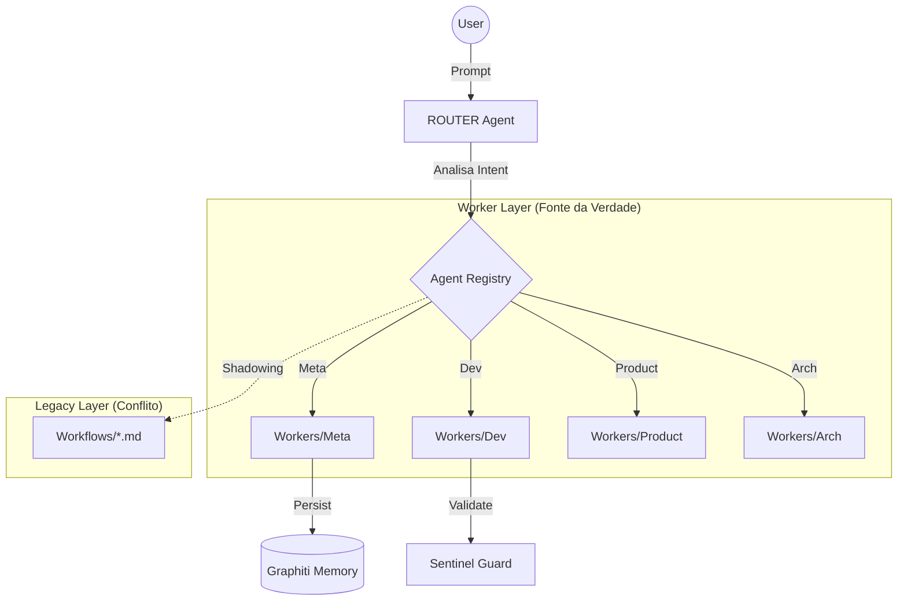

# 🕵️ Relatório de Auditoria Técnica de Agents $MILAGRE

> **Data:** 2026-01-05
> **Autor:** ANALISTA Agent (Audit Mode)
> **Alvo:** `/home/zenfoco/Dev/tokenmilagre-platform/.agent`
> **Status:** 🔴 CRÍTICO (Inconsistência Estrutural Detectada)

---

## 1. Inventário Técnico

O sistema opera sobre uma stack híbrida de **Next.js/TypeScript** com um framework de agents customizado.

### Stack
- **Runtime:** Node.js / `tsx`
- **Orquestração:** `lib/agents/agent-registry.ts` (Custom Registry)
- **Definição:** Markdown Frontmatter (`.md`)
- **Memória:** Graphiti (Vector/Graph Store) + Filesystem
- **Identidade:** Protocolo de Headers (Enforced by `mcp-sentinel`)

### Estrutura de Diretórios
- **`workers/`**: Contém a hierarquia oficial (`arch`, `dev`, `meta`, `product`). **(Fonte da Verdade)**
- **`workflows/`**: Contém cópias duplicadas de definições de agents. **(Débito Técnico)**
- **`processes/`**: Definições de processos operacionais (`debug`, `auditoria`).
- **`memory/`**: Documentos estáticos de contexto (`_DNA`, `MANIFESTO`).
- **`lib/agents/`**: Código do framework de orquestração e validação.

---

## 2. Diagrama de Fluxo (Lógico)

---

## 3. Relatório de Findings

| ID | Severidade | Local | Problema | Correção Proposta |
|----|------------|-------|----------|-------------------|
| **A-01** | 🔴 **CRÍTICO** | `.agent/workflows/` | **Duplicidade Estrutural:** 19 arquivos aqui duplicam definições da pasta `workers`. Isso causa ambiguidade no carregamento do registry. | **Remover** arquivos de agents da pasta `workflows`. Manter apenas workflows reais. |
| **A-02** | 🟡 MÉDIO | `lib/agents/agent-registry.ts` | **Carregamento Cego:** O sistema carrega arquivos recursivamente sem checar colisão de nomes. | Adicionar verificação de duplicidade no `loadAgentRegistry`. |
| **A-03** | 🔵 BAIXO | `workers/dev/DEVOPS-agent.md` | **Metadados Incompletos:** Faltando colaboração explícita com `CONHECIMENTO`. | Adicionar referência no frontmatter. |
| **A-04** | 🔵 BAIXO | `workers/meta/GENESIS-agent.md` | **Metadados Incompletos:** Faltando colaboração explícita com `CONHECIMENTO`. | Adicionar referência no frontmatter. |

---

## 4. Score de Maturidade

| Dimensão | Score (0-10) | Justificativa |
|----------|:------------:|---------------|
| **Arquitetura** | **8** | Padrão fractal e hierarquia "Power Law" bem definidos teoricamente. |
| **Código** | **9** | TypeScript bem tipado, Zod schemas, testes unitários de infraestrutura presentes. |
| **Organização** | **4** | **FALHA:** A duplicidade entre `workers` e `workflows` compromete a integridade. |
| **Segurança** | **7** | Protocolo de Identidade implementado, mas `ROUTER` falhou em verificação inicial. |
| **Observabilidade** | **6** | Logs básicos (`flight_recorder`), mas dependente de arquivos locais. |

> **Média:** 6.8 (Prejudicada severamente pela Organização)

---

## 5. Roadmap de Melhorias

### Prioridade 1: Saneamento (Imediato)
- [ ] Executar script de limpeza para remover agents de `.agent/workflows`.
- [ ] Validar integridade do registry após limpeza.

### Prioridade 2: Hardening
- [ ] Patch em `agent-registry.ts` para lançar erro em caso de duplicidade.
- [ ] Adicionar `DEVOPS` e `GENESIS` ao grafo de conhecimento explicitamente.

### Prioridade 3: Otimização
- [ ] Unificar definições de "Processos" e "Workflows" sob uma taxonomia clara.

---
