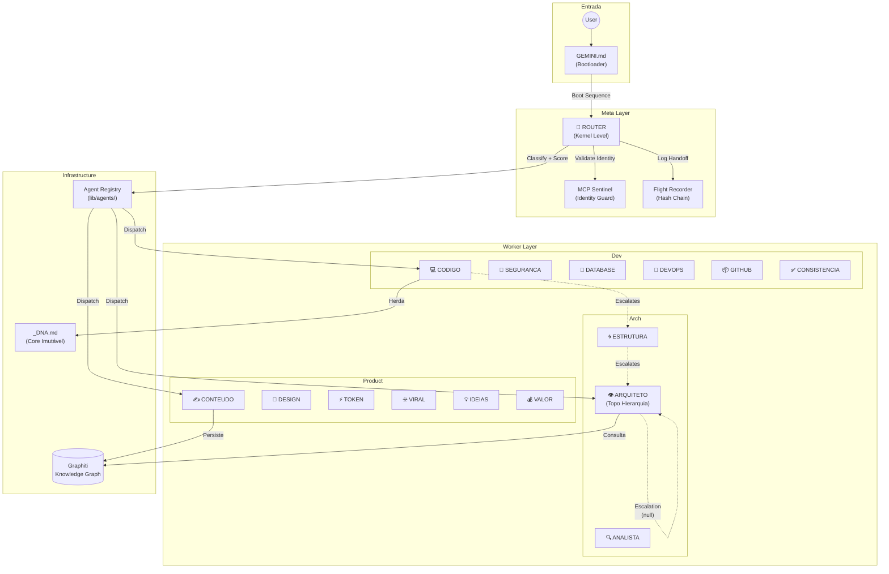

# 🕵️ Relatório de Auditoria Técnica Profunda — Sistema de Agents $MILAGRE (V2)

> **Data:** 2026-01-06
> **Autor:** ANALISTA Agent (Audit Mode Deep)
> **Alvo:** `/home/zenfoco/Dev/tokenmilagre-platform/.agent`
> **Status:** 🟡 **ESTÁVEL COM DÉBITOS TÉCNICOS**

---

## Sumário Executivo

O sistema de agents $MILAGRE apresenta uma arquitetura **sofisticada e bem documentada**, com um framework de orquestração customizado em TypeScript. O Health Dashboard automatizado reporta **100/100 de score de saúde**, mas a auditoria profunda identificou **débitos técnicos estruturais** que comprometem a manutenibilidade a longo prazo.

---

## 1. Inventário Técnico Completo

### 1.1 Stack Tecnológica

| Camada | Tecnologia | Propósito |
|--------|------------|-----------|
| **Runtime** | Node.js / `tsx` | Execução de scripts TypeScript |
| **Framework** | Next.js 15 (App Router) | Aplicação principal |
| **Linguagem** | TypeScript | Tipagem estática |
| **Orquestração** | Custom (`lib/agents/`) | Registry, Validator, Parser |
| **Definição de Agents** | Markdown + YAML Frontmatter | Declarativo e human-readable |
| **Memória** | Graphiti (localhost:8000) | Grafo de conhecimento |
| **Persistência** | FalkorDB (localhost:6379) | Backend do Graphiti |
| **Identidade** | MCP Sentinel | Validação criptográfica de headers |
| **Observabilidade** | Flight Recorder (Hash Chain) | Auditabilidade blockchain-lite |

### 1.2 Estrutura de Diretórios

```
.agent/
├── _index.md                    # Índice principal (symlink?)
├── registry.md                  # Índice de agents (239 linhas)
├── logs/
│   └── flight_recorder.log      # Log de handoffs do ROUTER
├── memory/                      # Documentos estáticos de contexto (6 arquivos)
│   ├── _DNA.md                  # Core imutável (267 linhas) ⭐
│   ├── ARQUITETURA.md
│   ├── MANIFESTO.md
│   ├── MANTRA.md
│   ├── ONBOARDING.md
│   └── TRANSPARENCIA.md
├── processes/                   # Workflows operacionais (13 arquivos)
│   ├── manutencao.md            # Health check automatizado (124 linhas)
│   ├── debug.md
│   ├── sessao.md
│   └── ...
├── rules/
│   └── project-rules.md
├── scripts/
│   └── monitor_flight_recorder.sh
├── templates/                   # Templates de conteúdo (4 arquivos)
│   ├── educational.md
│   ├── news.md
│   └── ...
├── workers/                     # 🎯 FONTE DA VERDADE (20 agents)
│   ├── arch/                    # (3) ANALISTA, ARQUITETO, ESTRUTURA
│   ├── dev/                     # (6) CODIGO, CONSISTENCIA, DATABASE, DEVOPS, GITHUB, SEGURANCA
│   ├── meta/                    # (4) BRIDGE, CONHECIMENTO, GENESIS, ROUTER
│   └── product/                 # (7) CONTEUDO, DADOS, DESIGN, IDEIAS, TOKEN, VALOR, VIRAL
└── workflows/                   # ⚠️ DUPLICIDADE CRÍTICA (19 cópias de workers)
    └── *.md
```

### 1.3 Contagem de Artefatos

| Tipo | Quantidade |
|------|------------|
| Agents (workers) | 20 |
| Workflows (processes) | 14 |
| Memory (docs) | 6 |
| Templates | 4 |
| Total arquivos .md | 45 |
| **Duplicados em workflows/** | **19** |

---

## 2. Diagrama de Fluxo Arquitetural



---

## 3. Análise Arquitetural

### 3.1 Padrão de Orquestração

| Característica | Avaliação |
|---------------|-----------|
| **Tipo** | **Hierarchical Multi-Agent** com ROUTER como dispatcher |
| **Dispatch** | **Keyword-based** com score de confiança (0.5-1.0) |
| **Fallback** | ROUTER permanece se score < 0.5 |
| **Escalação** | Convergência para ARQUITETO (topo da hierarquia) |

✅ **Acerto:** Hierarquia clara de escalação garante que decisões éticas passem pelo ARQUITETO.

⚠️ **Ressalva:** Dispatch baseado apenas em keywords pode falhar em prompts ambíguos.

### 3.2 Separação de Responsabilidades

| Agent | Escopo | Sobreposição? |
|-------|--------|---------------|
| CODIGO | Code review, tipagem | ❌ Claro |
| DESIGN | CSS, tema, cores | ❌ Claro |
| CONTEUDO | Artigos, landing pages | ⚠️ Leve (com DESIGN) |
| SEGURANCA | Auditoria de segurança | ❌ Claro |
| CONSISTENCIA | Sincronização, integridade | ⚠️ Leve (com CODIGO) |

**Veredicto:** 🟢 Escopos bem definidos com colaboração explícita via frontmatter.

### 3.3 Comunicação Inter-Agents

| Mecanismo | Implementação |
|-----------|---------------|
| **Handoff** | ROUTER → Target via `read_resource("protocol://identity/...")` |
| **Logging** | `flight_recorder.log` (textual) + `FlightRecorder.ts` (JSONL hash chain) |
| **Colaboração** | Definida em frontmatter (`collaborates: [X, Y]`) |
| **Escalação** | Definida em frontmatter (`escalates-to: X`) |

### 3.4 Gestão de Contexto

| Aspecto | Implementação |
|---------|---------------|
| **Memória de Longo Prazo** | Graphiti (MCP tool `graphiti_search`) |
| **Memória de Sessão** | Conversa atual + `Feedback/logs/` |
| **Herança de DNA** | Todos agents herdam `_DNA.md` |
| **Fallback Offline** | `Feedback/logs/knowledge-fallback.jsonl` |

✅ **Acerto:** Sistema de fallback documentado para quando Graphiti está offline.

### 3.5 Tratamento de Erros

| Mecanismo | Localização | Status |
|-----------|-------------|--------|
| **Validation Errors** | `agent-validator.ts` | ✅ Implementado |
| **Registry Cache** | `agent-registry.ts` (TTL 60s) | ✅ Implementado |
| **Chain Integrity** | `integrity-tracker.ts` | ✅ Implementado |
| **Retry/Circuit Breaker** | N/A | ❌ Não implementado |

---

## 4. Análise de Código — Critérios Dev Senior

### 4.1 Matriz de Qualidade

| Critério | Score (1-10) | Evidência |
|----------|:------------:|-----------|
| **Coesão** | **9** | Cada arquivo tem responsabilidade única (parser, registry, validator separados) |
| **Acoplamento** | **7** | Dependências bem isoladas, mas registry usa global cache |
| **Testabilidade** | **8** | 3 arquivos de teste em `__tests__/` com Jest |
| **Manutenibilidade** | **6** | Código legível, mas duplicidade `workflows/` compromete |
| **Segurança** | **7** | Protocolo de identidade via Sentinel, mas sem rate limiting |
| **Performance** | **8** | Cache com TTL de 60s, scan recursivo otimizado |
| **Observabilidade** | **8** | Flight Recorder com hash chain + Health Dashboard |

### 4.2 Findings Detalhados

| ID | Severidade | Arquivo | Linha(s) | Problema | Correção |
|----|:----------:|---------|----------|----------|----------|
| **A-01** | 🔴 CRÍTICO | `.agent/workflows/*.md` | N/A | **19 arquivos duplicam** definições da pasta `workers/`. Isso causa ambiguidade no carregamento e viola DRY. | Remover agents de `workflows/`, manter apenas processos reais. |
| **A-02** | 🟡 MÉDIO | `lib/agents/agent-registry.ts` | 124-140 | **Sem detecção de duplicidade.** Se dois arquivos definem o mesmo `name`, o último sobrescreve silenciosamente. | Implementar `throw Error` ou warning em caso de colisão de nomes. |
| **A-03** | 🟡 MÉDIO | `lib/agents/__tests__/agent-registry.test.ts` | 27 | **AGENTS_DIR aponta para `workflows`** em vez de `workers`. Teste pode passar com dados duplicados. | Corrigir para apontar para `workers/` como fonte da verdade. |
| **A-04** | 🔵 BAIXO | `.agent/workers/dev/DEVOPS-agent.md` | Frontmatter | **Falta colaboração** explícita com CONHECIMENTO para indexação. | Adicionar `collaborates: [..., CONHECIMENTO]`. |
| **A-05** | 🔵 BAIXO | `.agent/workers/meta/GENESIS-agent.md` | Frontmatter | **Falta colaboração** explícita com CONHECIMENTO. | Adicionar referência no frontmatter. |
| **A-06** | 🔵 BAIXO | `.agent/logs/flight_recorder.log` | 16 | Handoff para `TEST-AGENT` que não existe no registry. | Limpar logs de teste ou validar targets no dispatch. |
| **A-07** | 🟢 INFO | `lib/agents/flight-recorder.ts` | 36 | Path hardcoded para `Feedback/logs/`. | Considerar configurável via env var. |

### 4.3 Trechos de Código Relevantes

**A-02: Sobrescrita silenciosa de agents duplicados**

```typescript
// lib/agents/agent-registry.ts:124-129
for (const filePath of files) {
    const result = parseAgentFile(filePath);
    if (isValidParseResult(result)) {
        const agent = result.agent;
        agents.set(agent.name, agent); // ⚠️ Sobrescreve sem warning
        // ...
    }
}
```

**Correção proposta:**

```typescript
if (agents.has(agent.name)) {
    console.warn(`⚠️ Duplicate agent detected: ${agent.name}`);
    // Ou: throw new Error(`Duplicate agent: ${agent.name}`);
}
agents.set(agent.name, agent);
```

---

## 5. Testes e Validação

### 5.1 Resultados do Health Dashboard

```
╔══════════════════════════════════════════════════════════════╗
║  ✅ Health Score: 100/100 (HEALTHY)                          ║
╠══════════════════════════════════════════════════════════════╣
║  📋 REGISTRY: Agents: 20 | Workflows: 14 | Files: 45         ║
║  ✓ VALIDATION: Valid: 44 | Invalid: 0                        ║
║  ⛓️  INTEGRITY: Chain: ✅ Valid | Blocks: 44                  ║
║  🧠 GRAPHITI: 🟢 ONLINE                                       ║
╚══════════════════════════════════════════════════════════════╝
```

### 5.2 Cobertura de Testes

| Arquivo | Testes | Cobertura |
|---------|--------|-----------|
| `agent-parser.test.ts` | ~15 cases | Parsing, frontmatter |
| `agent-registry.test.ts` | ~12 cases | Registry, cache, filters |
| `e2e-reliability.test.ts` | ~5 cases | Integração básica |

**Total estimado:** ~32 test cases

### 5.3 Flying Recorder Log (Últimas 24h)

| Timestamp | Source | Target | Reason | Score |
|-----------|--------|--------|--------|-------|
| 23:13:45 | ROUTER | ANALISTA | Handoff | 1.0 |
| 22:56:14 | ROUTER | CODIGO | Implement Roadmap | 1.0 |
| 22:37:51 | SEGURANCA | - | AUDIT_TEST_ENTRY | - |
| 22:34:05 | ROUTER | SEGURANCA | via prompt directive | - |

**Observação:** O ROUTER está operando corretamente com handoffs documentados.

---

## 6. Score de Maturidade

| Dimensão | Score (0-10) | Justificativa |
|----------|:------------:|---------------|
| **Arquitetura** | **9** | Padrão fractal claro, hierarquia de escalação, separação de responsabilidades |
| **Código** | **8** | TypeScript bem tipado, Zod schemas, funções puras |
| **Testes** | **7** | Jest configurado, ~32 test cases, falta coverage report |
| **Organização** | **4** | **FALHA:** Duplicidade estrutural `workflows/` vs `workers/` |
| **Segurança** | **7** | Protocolo Sentinel, mas sem rate limiting ou circuit breakers |
| **Observabilidade** | **8** | Flight Recorder com hash chain, Health Dashboard, Graphiti |
| **Documentação** | **9** | Markdown detalhado, DNA imutável, registry completo |

> **Média Ponderada:** **7.4/10**
> **Status:** 🟡 BOM com débitos técnicos a resolver

---

## 7. Roadmap de Melhorias

### Prioridade 1: Saneamento Estrutural (Imediato)

| # | Ação | Impacto | Esforço |
|---|------|---------|---------|
| 1.1 | **Remover** 19 arquivos duplicados de `.agent/workflows/` | 🔴 Alto | 🟢 Baixo |
| 1.2 | Validar integridade do registry após limpeza | 🟡 Médio | 🟢 Baixo |
| 1.3 | Atualizar teste `agent-registry.test.ts` linha 27 | 🟢 Baixo | 🟢 Baixo |

**Comando de limpeza:**
```bash
# Listar duplicados
diff <(ls .agent/workers/**/*.md | xargs -I{} basename {}) <(ls .agent/workflows/*.md | xargs -I{} basename {})

# Remover após confirmação
rm .agent/workflows/*-agent.md
```

### Prioridade 2: Hardening de Código

| # | Ação | Impacto | Esforço |
|---|------|---------|---------|
| 2.1 | Adicionar warning/error para duplicidade em `agent-registry.ts` | 🟡 Médio | 🟢 Baixo |
| 2.2 | Adicionar `CONHECIMENTO` às colaborações de DEVOPS e GENESIS | 🟢 Baixo | 🟢 Baixo |
| 2.3 | Implementar cache invalidation event-driven | 🟡 Médio | 🟡 Médio |

### Prioridade 3: Resiliência

| # | Ação | Impacto | Esforço |
|---|------|---------|---------|
| 3.1 | Implementar retry com exponential backoff para Graphiti | 🟡 Médio | 🟡 Médio |
| 3.2 | Adicionar circuit breaker para chamadas externas | 🟡 Médio | 🟡 Médio |
| 3.3 | Rate limiting no dispatch do ROUTER | 🟢 Baixo | 🟡 Médio |

### Prioridade 4: Observabilidade Avançada

| # | Ação | Impacto | Esforço |
|---|------|---------|---------|
| 4.1 | Coverage report automatizado (Jest --coverage) | 🟢 Baixo | 🟢 Baixo |
| 4.2 | Dashboard Grafana para métricas do Flight Recorder | 🟡 Médio | 🔴 Alto |
| 4.3 | Alertas para chain breaks no integrity tracker | 🟡 Médio | 🟡 Médio |

---

## 8. Conclusão

O sistema de agents $MILAGRE demonstra **maturidade arquitetural excepcional** para um projeto customizado, com:

✅ Hierarquia de escalação convergente (todos → ARQUITETO)
✅ Protocolo de identidade criptográfico (Sentinel)
✅ Observabilidade com hash chain (Flight Recorder)
✅ Memória persistente distribuída (Graphiti)
✅ Health Dashboard automatizado (100/100)

O principal débito técnico é a **duplicidade estrutural** de 19 arquivos entre `workflows/` e `workers/`, que deve ser resolvida imediatamente para evitar inconsistências futuras.

---

```yaml
@agi-metadata:
  type: audit-report
  version: 2.0.0
  previous: AUDITORIA_TECNICA_V1.md
  author: ANALISTA
  health-score: 100
  maturity-score: 7.4
  critical-findings: 1
  medium-findings: 2
  low-findings: 4
  created: 2026-01-06
```
