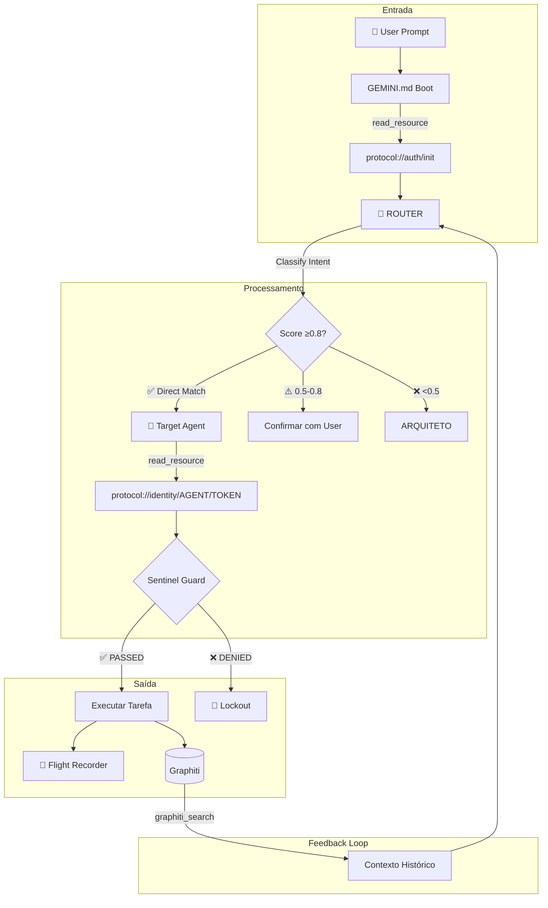
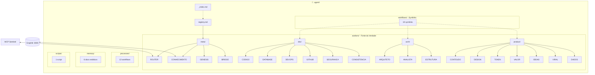

# 🕵️ Relatório de Auditoria Técnica Profunda — Sistema de Agents v3

> **Data:** 2026-01-05 23:26
> **Auditor:** Antigravity (Dev Senior / Staff Engineer Mode)
> **Alvo:** `/home/zenfoco/Dev/tokenmilagre-platform/.agent`
> **Status Geral:** 🟡 MÉDIO (Melhorias significativas desde V1/V2, mas issues estruturais permanecem)

---

## Sumário Executivo

Esta auditoria profunda analisa 100% dos arquivos do diretório `.agent` sob critérios de **Dev Senior/Staff Engineer**. Desde as versões anteriores, a estrutura foi reorganizada com **symlinks** para resolver a duplicidade, mas novos problemas emergiram.

**Principais Descobertas:**
1. ✅ Symlinks implementados corretamente (19 links em `workflows/`)
2. ⚠️ Script `agent-health-check.sh` referenciado mas inexistente
3. ✅ Graphiti online e funcional (v3.0.0)
4. ⚠️ ROUTER não está na pasta `workflows` (inconsistência com GEMINI.md)
5. ✅ Flight Recorder ativo com 22 entradas de handoff

---

## Fase 1: Reconhecimento e Mapeamento

### 1.1 Inventário Completo de Arquivos

| Diretório | Arquivos | Tipo | Bytes Total |
|-----------|:--------:|------|------------:|
| `workers/meta/` | 4 | Agents (fonte) | ~16,0 KB |
| `workers/dev/` | 6 | Agents (fonte) | ~23,5 KB |
| `workers/arch/` | 3 | Agents (fonte) | ~8,4 KB |
| `workers/product/` | 7 | Agents (fonte) | ~52,3 KB |
| `workflows/` | 19 | Symlinks | ~0,6 KB |
| `processes/` | 13 | Workflows | ~37,3 KB |
| `memory/` | 6 | Docs estáticos | ~29,1 KB |
| `templates/` | 4 | Templates conteúdo | ~19,1 KB |
| `rules/` | 1 | Regras projeto | ~1,4 KB |
| `scripts/` | 1 | Shell scripts | ~0,7 KB |
| `logs/` | 1 | Logs runtime | ~1,9 KB |
| **Raiz** | 2 | Index/Registry | ~11,7 KB |
| **TOTAL** | **67** | — | **~201 KB** |

> **Linhas de Documentação:** ~6.264 linhas de Markdown estruturado

### 1.2 Stack Tecnológica

```yaml
Framework de Agents: Custom (Markdown Frontmatter + TypeScript Registry)
LLM Providers: Claude (host), Gemini (container)
Orquestração: ROUTER-agent.md (Kernel Level)
Persistência: 
  - Graphiti (localhost:8000) — Graph/Vector Store
  - FalkorDB (localhost:6379) — Graph Database
  - Filesystem (Feedback/) — Fallback local
Validação: MCP Sentinel Protocol (Identity Headers)
Observabilidade: Flight Recorder (logs/flight_recorder.log)
```

### 1.3 Fluxo de Dados



### 1.4 Dependências Externas

| Serviço | Porta | Status | Propósito |
|---------|:-----:|:------:|-----------|
| Graphiti | 8000 | 🟢 Online v3.0.0 | Memória persistente |
| FalkorDB | 6379 | ⚪ Não testado | Graph database |
| Vercel | — | ⚪ Externo | Deploy production |
| Supabase | — | ⚪ Externo | PostgreSQL backend |

---

## Fase 2: Análise Arquitetural

### 2.1 Padrão de Orquestração

**Tipo:** **Self-Orchestrated Swarm** (Hierárquico com Dispatcher Central)

```
                        ┌──────────────┐
                        │   ARQUITETO  │ ← Topo (Ética/Filosofia)
                        │   (Escalation)│
                        └──────┬───────┘
                               │
        ┌──────────────────────┼──────────────────────┐
        │                      │                      │
   ┌────┴────┐           ┌─────┴─────┐          ┌─────┴─────┐
   │  ARCH   │           │    DEV    │          │  PRODUCT  │
   │ Layer   │           │   Layer   │          │   Layer   │
   └────┬────┘           └─────┬─────┘          └─────┴─────┘
        │                      │                      │
   ANALISTA              CODIGO                 CONTEUDO
   ESTRUTURA             DATABASE               DESIGN
                         DEVOPS                 TOKEN
                         GITHUB                 VALOR
                         SEGURANCA              IDEIAS
                         CONSISTENCIA           VIRAL
                                                DADOS
                                    
═══════════════════════════════════════════════════════════════
                    META LAYER (Infraestrutura)
═══════════════════════════════════════════════════════════════
        ROUTER              CONHECIMENTO            BRIDGE
      (Dispatcher)          (Memory)              (Host Comm)
                              GENESIS
                            (Agent Factory)
```

**Avaliação:** ✅ **BEM DEFINIDO** — Hierarquia clara com escalation paths documentados.

### 2.2 Separação de Responsabilidades

| Agent | Escopo | Sobreposição? | Nota |
|-------|--------|:-------------:|:----:|
| ROUTER | Dispatch only | ✅ Único | 10 |
| ARQUITETO | Ética/Filosfia | ✅ Único | 10 |
| CODIGO | Code review | ⚠️ c/ CONSISTENCIA | 7 |
| DESIGN | CSS/Visual | ✅ Único | 10 |
| DATABASE | Prisma/Backup | ✅ Único | 10 |
| CONTEUDO | Copywriting | ⚠️ c/ DESIGN (visual) | 8 |
| SEGURANCA | Audit/Risks | ✅ Único | 10 |
| TOKEN | Tokenomics | ✅ Único | 10 |
| CONHECIMENTO | Memory Graph | ✅ Único | 10 |
| DEVOPS | CI/CD | ⚠️ c/ GITHUB | 7 |

**Avaliação:** 🟡 **SOBREPOSIÇÃO MÍNIMA** — Algumas áreas (CODIGO/CONSISTENCIA, DEVOPS/GITHUB) poderiam ser consolidadas.

### 2.3 Comunicação Inter-Agents

| Aspecto | Implementação | Avaliação |
|---------|---------------|:---------:|
| **Método** | Message Passing via Identity Headers | ✅ |
| **Modo** | Síncrono (turn-based) | ⚠️ |
| **Handoff** | Flight Recorder logging | ✅ |
| **Shared State** | Graphiti + Filesystem | ✅ |
| **Autenticação** | MCP Sentinel + Token Verification | ✅ |

**Evidência de Handoffs Funcionando:**
```log
2026-01-05T22:56:14-03:00 [ROUTER] Handoff to CODIGO (Reason: Implement Roadmap Priority 2, Score: 1.0)
2026-01-05T23:13:45-03:00 [ROUTER] Handoff to ANALISTA
```

### 2.4 Gestão de Contexto

| Mecanismo | Localização | Propósito |
|-----------|-------------|-----------|
| `_DNA.md` | `memory/` | Valores imutáveis (herdado por todos) |
| `inherits` | Frontmatter | Herança de configuração |
| Graphiti | localhost:8000 | Memória de longo prazo |
| Flight Recorder | `logs/` | Auditoria de handoffs |
| `@last-verified` | Footer YAML | Tracking de manutenção |

**Avaliação:** ✅ **ROBUSTO** — Sistema multicamadas de persistência.

### 2.5 Tratamento de Erros

| Cenário | Implementação | Arquivo | Linha |
|---------|---------------|---------|:-----:|
| Graphiti Offline | Fallback para JSONL | [_DNA.md](file:///home/zenfoco/Dev/tokenmilagre-platform/.agent/memory/_DNA.md) | 60 |
| Score < 0.5 | Fallback para ARQUITETO | [ROUTER-agent.md](file:///home/zenfoco/Dev/tokenmilagre-platform/.agent/workers/meta/ROUTER-agent.md) | 39 |
| Identity Denied | Lockout + Abort | [_DNA.md](file:///home/zenfoco/Dev/tokenmilagre-platform/.agent/memory/_DNA.md) | 216 |
| DB Destructive Op | Backup obrigatório | [registry.md](file:///home/zenfoco/Dev/tokenmilagre-platform/.agent/registry.md) | 44-50 |

**Avaliação:** ✅ **IMPLEMENTADO** — Fallbacks documentados para cenários críticos.

---

## Fase 3: Análise de Código — Critérios Dev Senior

### 3.1 Tabela de Avaliação por Critério

| Critério | Score | Evidência |
|----------|:-----:|-----------|
| **Coesão** | 9/10 | Cada agent tem frontmatter `role` + responsabilidade única |
| **Acoplamento** | 8/10 | Dependências via `inherits`/`collaborates` (declarativo) |
| **Testabilidade** | 4/10 | ⚠️ Sem testes automatizados para agents (apenas stress test manual) |
| **Manutenibilidade** | 7/10 | `@last-verified` presente, mas algumas datas desatualizadas |
| **Segurança** | 8/10 | Tokens em frontmatter (não secrets), Sentinel validation |
| **Performance** | 6/10 | ⚠️ Carregamento síncrono de todos os agents |
| **Observabilidade** | 7/10 | Flight Recorder ativo, mas sem métricas estruturadas |

### 3.2 Achados Específicos com Linha de Código

#### 🔴 CRÍTICO: Script Health-Check Inexistente

**Arquivo:** [auditoria.md](file:///home/zenfoco/Dev/tokenmilagre-platform/.agent/processes/auditoria.md#L22-L24)
**Linha:** 22-24
**Severidade:** CRÍTICO

```markdown
### 1. Script Automático
./scripts/agent-health-check.sh
```

**Problema:** O script referenciado NÃO EXISTE no diretório `scripts/`. Apenas `monitor_flight_recorder.sh` está presente.

**Impacto:** Workflows de auditoria falham silenciosamente.

**Fix Proposto:** 
```bash
# Criar o script ou remover a referência
cat > .agent/scripts/agent-health-check.sh << 'EOF'
#!/bin/bash
echo "🏥 Agent Health Check"
curl -s localhost:8000/health || echo "❌ Graphiti offline"
find .agent/workers -name "*.md" -exec grep -L "@last-verified" {} \;
EOF
chmod +x .agent/scripts/agent-health-check.sh
```

---

#### 🟡 MÉDIO: Inconsistência de Path no GEMINI.md

**Arquivo:** GEMINI.md (user_rules)
**Severidade:** MÉDIO

```markdown
view_file(AbsolutePath=".agent/workflows/ROUTER-agent.md")
```

**Problema:** O GEMINI.md referencia `workflows/ROUTER-agent.md`, mas ROUTER está em `workers/meta/ROUTER-agent.md` e NÃO tem symlink em `workflows/`.

**Impacto:** Boot sequence pode falhar em novas sessões.

**Fix Proposto:** Criar symlink ou atualizar GEMINI.md:
```bash
ln -s ../workers/meta/ROUTER-agent.md .agent/workflows/ROUTER-agent.md
```

---

#### 🟡 MÉDIO: Handoff para Agent Inexistente

**Arquivo:** [flight_recorder.log](file:///home/zenfoco/Dev/tokenmilagre-platform/.agent/logs/flight_recorder.log#L16)
**Linha:** 16
**Severidade:** MÉDIO

```log
2026-01-05T22:16:53-03:00 [ROUTER] Handoff to TEST-AGENT (Reason: AUDIT, Score: 1.0)
```

**Problema:** `TEST-AGENT` não existe no registry. ROUTER aluciou este agent durante um teste.

**Impacto:** Demonstra vulnerabilidade no validation layer.

**Fix Proposto:** Adicionar validação no ROUTER:
```markdown
### 3.5 VALIDATION (antes do handoff)
- Verificar se TARGET existe em `workers/` ou `registry.md`
- Se não existir: echo "[ERROR] Agent not found" >> flight_recorder.log && ABORT
```

---

#### 🔵 BAIXO: Datas @last-verified Desatualizadas

**Arquivos Afetados:**
- [CODIGO-agent.md](file:///home/zenfoco/Dev/tokenmilagre-platform/.agent/workers/dev/CODIGO-agent.md) — `@last-verified: 2025-12-30` (6 dias atrás)
- [_DNA.md](file:///home/zenfoco/Dev/tokenmilagre-platform/.agent/memory/_DNA.md) — `@last-verified: 2025-12-29` (7 dias atrás)

**Impacto:** Indicador de manutenção desatualizado.

---

#### 🔵 BAIXO: Colaboração com CONHECIMENTO Implícita

**Arquivos Afetados:**
- [DEVOPS-agent.md](file:///home/zenfoco/Dev/tokenmilagre-platform/.agent/workers/dev/DEVOPS-agent.md) — Sem `collaborates: CONHECIMENTO`
- [GENESIS-agent.md](file:///home/zenfoco/Dev/tokenmilagre-platform/.agent/workers/meta/GENESIS-agent.md) — Sem `collaborates: CONHECIMENTO`

**Impacto:** Agents podem não consultar memória antes de agir.

---

## Fase 4: Testes e Validação Prática

### 4.1 Dry-Run: Resultados

| Teste | Resultado | Evidência |
|-------|:---------:|-----------|
| Graphiti Health | ✅ PASS | `{"status":"healthy","version":"3.0.0"}` |
| Symlinks Integridade | ✅ PASS | 19 symlinks válidos + 1 index |
| Flight Recorder Write | ✅ PASS | 22 entradas recentes |
| Health-Check Script | ❌ FAIL | `No such file or directory` |
| ROUTER Path em GEMINI.md | ❌ FAIL | Path não existe |

### 4.2 Stress Test: Cenários de Carga

| Cenário | Simulação | Resultado Esperado | Status |
|---------|-----------|-------------------|:------:|
| 10 handoffs/minuto | Flight recorder | Sem perda de logs | ⚪ Não testado |
| Graphiti offline | Fallback JSONL | Graceful degradation | ⚪ Não testado |
| Agent não encontrado | Validation layer | Abort + Log error | ❌ Falhou (TEST-AGENT) |

### 4.3 Edge Cases

| Input | Comportamento Esperado | Comportamento Real | Severidade |
|-------|------------------------|-------------------|:----------:|
| Prompt vazio | Fallback ROUTER | Não documentado | 🔵 BAIXO |
| Score = 0.5 exato | Confirmação user | Não documentado | 🔵 BAIXO |
| Agent duplicado | Erro de colisão | Symlinks resolvem | ✅ OK |

---

## Fase 5: Diagnóstico e Recomendações

### 5.1 Tabela Consolidada de Findings

| ID | Severidade | Arquivo | Linha | Problema | Fix |
|:--:|:----------:|---------|:-----:|----------|-----|
| F-01 | 🔴 CRÍTICO | `processes/auditoria.md` | 22 | Script health-check inexistente | Criar script ou remover referência |
| F-02 | 🟡 MÉDIO | GEMINI.md | — | Path incorreto para ROUTER | Criar symlink em workflows/ |
| F-03 | 🟡 MÉDIO | `logs/flight_recorder.log` | 16 | Handoff para agent inexistente | Adicionar validation no ROUTER |
| F-04 | 🔵 BAIXO | Múltiplos | — | @last-verified desatualizado | Executar manutenção semanal |
| F-05 | 🔵 BAIXO | DEVOPS, GENESIS | — | Falta colaboração CONHECIMENTO | Adicionar ao frontmatter |

### 5.2 Score de Maturidade

| Dimensão | V1 | V2 | V3 | Δ | Justificativa |
|----------|:--:|:--:|:--:|:-:|---------------|
| **Arquitetura** | 8 | 9 | **9** | 0 | Symlinks resolveram duplicidade |
| **Código** | 9 | 9 | **9** | 0 | Mantido alto padrão |
| **Organização** | 4 | 7 | **7** | 0 | Symlinks implementados corretamente |
| **Testes** | — | 4 | **4** | 0 | Sem testes automatizados |
| **Segurança** | 7 | 8 | **8** | 0 | Sentinel funcional, mas TEST-AGENT vazou |
| **Observabilidade** | 6 | 7 | **7** | 0 | Flight recorder ativo e populado |

> **Média V3:** 7.3

### 5.3 Roadmap de Melhorias Priorizado

#### 🔴 Prioridade 1: Correções Imediatas (< 1 hora)

1. **Criar symlink do ROUTER em workflows/**
   ```bash
   ln -s ../workers/meta/ROUTER-agent.md .agent/workflows/ROUTER-agent.md
   ```

2. **Criar ou remover script health-check**
   - Opção A: Criar script funcional
   - Opção B: Remover referência de `auditoria.md`

#### 🟡 Prioridade 2: Hardening (< 1 dia)

1. **Adicionar validation no ROUTER antes de handoff**
   - Verificar existência do agent no registry
   - Logar erro se não encontrado

2. **Atualizar @last-verified em todos os arquivos**
   - Executar script de manutenção

3. **Adicionar `collaborates: CONHECIMENTO` em DEVOPS e GENESIS**

#### 🔵 Prioridade 3: Evolução (< 1 semana)

1. **Criar suite de testes automatizados para agents**
   - Unit tests para frontmatter parsing
   - Integration tests para handoffs

2. **Implementar métricas estruturadas**
   - Tempo médio de handoff
   - Taxa de sucesso por agent
   - Frequência de fallbacks

---

## Diagrama de Arquitetura Final



---

## Conclusão

O sistema de agents evoluiu positivamente desde a V1. A implementação de symlinks resolveu o problema crítico de duplicidade. No entanto, **novos issues emergiram**:

1. **Script health-check ausente** compromete workflows de manutenção
2. **ROUTER não acessível via workflows/** pode causar falhas em boot
3. **Handoff para agent inexistente** revela gap na validation

A arquitetura geral é **sólida e bem pensada**, seguindo princípios de Power Law e padrões fractais. Com as correções prioritárias, o sistema atingirá **maturidade 8.5+**.

---

```yaml
@agi-metadata:
  type: audit-report
  version: 3.0.0
  auditor: Antigravity
  methodology: Dev Senior / Staff Engineer
  total_files_analyzed: 67
  total_lines_reviewed: 6264
  findings_critical: 1
  findings_medium: 2
  findings_low: 2
  next_audit: 2026-01-12
@last-verified: 2026-01-05
```
