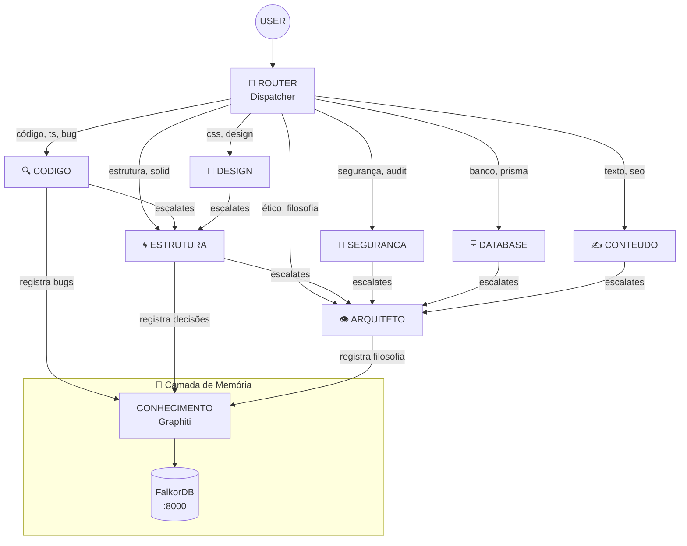

# 🔬 Auditoria Técnica Profunda — Sistema de Agents v1

**Alvo:** `/home/zenfoco/Dev/tokenmilagre-platform/.agent`  
**Data:** 2026-01-05  
**Nível de Rigor:** Dev Senior / Staff Engineer  
**Auditor:** Antigravity (Gemini) atuando como ANALISTA  

---

## 📋 Sumário Executivo

| Métrica | Valor |
|---------|-------|
| **Total de Arquivos** | 79 |
| **Agents Identificados** | 20 workers + 1 ROUTER (meta) |
| **Workflows/Processos** | 13 |
| **Templates** | 4 |
| **Documentos de Memória** | 6 |
| **Padrão de Orquestração** | **Hierarchical Multi-Agent** |
| **Status do Graphiti** | ✅ Healthy (v3.0.0) |
| **Flight Recorder** | ✅ Ativo (22 entradas) |

---

## 1️⃣ Fase 1: Inventário Técnico Completo

### 1.1 Estrutura de Diretórios

```
.agent/
├── _index.md              # Registro principal de agents
├── registry.md            # Duplicate de _index.md (⚠️ FINDING)
├── logs/
│   └── flight_recorder.log
├── memory/
│   ├── _DNA.md            # Core values (herdado por todos)
│   ├── ARQUITETURA.md
│   ├── MANIFESTO.md
│   ├── MANTRA.md
│   ├── ONBOARDING.md
│   └── TRANSPARENCIA.md
├── processes/             # 13 workflows
│   ├── agent-test.md
│   ├── auditoria.md
│   ├── chaos.md
│   ├── criador-conteudo.md
│   ├── debug.md
│   ├── execucao.md
│   ├── layout.md
│   ├── manutencao.md
│   ├── plano.md
│   ├── sessao.md
│   ├── tdd.md
│   ├── verificacao.md
│   └── vibe.md
├── rules/
│   └── project-rules.md
├── scripts/
│   └── monitor_flight_recorder.sh
├── templates/             # 4 templates de conteúdo
│   ├── educational.md
│   ├── news.md
│   ├── resource.md
│   └── trends.md
└── workers/               # 20 agents
    ├── arch/              # 3 agents
    │   ├── ANALISTA-agent.md
    │   ├── ARQUITETO-agent.md
    │   └── ESTRUTURA-agent.md
    ├── dev/               # 6 agents
    │   ├── CODIGO-agent.md
    │   ├── CONSISTENCIA-agent.md
    │   ├── DATABASE-agent.md
    │   ├── DEVOPS-agent.md
    │   ├── GITHUB-agent.md
    │   └── SEGURANCA-agent.md
    ├── meta/              # 4 agents
    │   ├── BRIDGE-agent.md
    │   ├── CONHECIMENTO-agent.md
    │   ├── GENESIS-agent.md
    │   └── ROUTER-agent.md
    └── product/           # 7 agents
        ├── CONTEUDO-agent.md
        ├── DADOS-agent.md
        ├── DESIGN-agent.md
        ├── IDEIAS-agent.md
        ├── TOKEN-agent.md
        ├── VALOR-agent.md
        └── VIRAL-agent.md
```

### 1.2 Catálogo de Agents

| Agent | Domínio | Arquivo | identity-token | escalates-to | Propósito |
|-------|---------|---------|----------------|--------------|-----------|
| **ROUTER** | meta | `workers/meta/ROUTER-agent.md` | `80eb537c` | — | Dispatcher automático (KERNEL LEVEL) |
| **ARQUITETO** | arch | `workers/arch/ARQUITETO-agent.md` | `705ab88a` | `null` | Guardião filosófico (topo da hierarquia) |
| **ANALISTA** | arch | `workers/arch/ANALISTA-agent.md` | — | ARQUITETO | Análise crítica/UX |
| **ESTRUTURA** | arch | `workers/arch/ESTRUTURA-agent.md` | `df50dbd7` | ARQUITETO | Arquitetura fractal |
| **CODIGO** | dev | `workers/dev/CODIGO-agent.md` | `2d622bd0` | ESTRUTURA | Revisão de código |
| **CONSISTENCIA** | dev | `workers/dev/CONSISTENCIA-agent.md` | — | — | Verificação de consistência |
| **DATABASE** | dev | `workers/dev/DATABASE-agent.md` | `0aad42d5` | ARQUITETO | Backup/Migrações |
| **DEVOPS** | dev | `workers/dev/DEVOPS-agent.md` | — | ARQUITETO | CI/CD, Deploy |
| **GITHUB** | dev | `workers/dev/GITHUB-agent.md` | — | — | Versionamento |
| **SEGURANCA** | dev | `workers/dev/SEGURANCA-agent.md` | `7c592edc` | ARQUITETO | Auditoria de segurança |
| **BRIDGE** | meta | `workers/meta/BRIDGE-agent.md` | — | — | Comunicação com host |
| **CONHECIMENTO** | meta | `workers/meta/CONHECIMENTO-agent.md` | `690f8918` | ARQUITETO | Grafo de conhecimento |
| **GENESIS** | meta | `workers/meta/GENESIS-agent.md` | — | ARQUITETO | Criador de agents |
| **CONTEUDO** | product | `workers/product/CONTEUDO-agent.md` | `7ad8757e` | ARQUITETO | Criação de conteúdo |
| **DADOS** | product | `workers/product/DADOS-agent.md` | — | ARQUITETO | Estatísticas/Métricas |
| **DESIGN** | product | `workers/product/DESIGN-agent.md` | `039f1a71` | ESTRUTURA | Sistema de design |
| **IDEIAS** | product | `workers/product/IDEIAS-agent.md` | — | ARQUITETO | Brainstorming |
| **TOKEN** | product | `workers/product/TOKEN-agent.md` | — | ARQUITETO | Tokenomics |
| **VALOR** | product | `workers/product/VALOR-agent.md` | — | ARQUITETO | ROI/Monetização |
| **VIRAL** | product | `workers/product/VIRAL-agent.md` | — | ARQUITETO | Growth hacking |

---

## 2️⃣ Fase 2: Análise Arquitetural

### 2.1 Padrão de Orquestração

> **Classificação: Hierarchical Multi-Agent com Router Central**



### 2.2 Separação de Responsabilidades

| Critério | Status | Evidência |
|----------|--------|-----------|
| **Escopo único por agent** | ✅ Bom | Cada agent tem `role` e `trigger` distintos no frontmatter |
| **Sem sobreposição de triggers** | ⚠️ Parcial | "audit" aparece em SEGURANCA e processo auditoria.md |
| **Hierarquia clara** | ✅ Bom | Todos escalate para ARQUITETO (topo) |

### 2.3 Comunicação Inter-Agents

| Mecanismo | Implementação | Evidência |
|-----------|---------------|-----------|
| **Dispatch** | ROUTER keyword matching | `ROUTER-agent.md:17-34` - Tabela de keywords |
| **Escalation** | Campo `escalates-to` no frontmatter | Todos agents definem |
| **Collaboration** | Campo `collaborates` no frontmatter | Ex: `CODIGO: [ESTRUTURA, SEGURANCA]` |
| **Logging** | Flight Recorder | `.agent/logs/flight_recorder.log` |

### 2.4 Gestão de Contexto

| Mecanismo | Status | Arquivo |
|-----------|--------|---------|
| **DNA compartilhado** | ✅ Implementado | `memory/_DNA.md` herdado por todos |
| **Graphiti (memória persistente)** | ✅ Healthy | `lib/knowledge/tracker.ts` |
| **Fallback local** | ✅ Documentado | `Feedback/logs/knowledge-fallback.jsonl` |
| **Flight Recorder** | ✅ Ativo | 22 entradas registradas hoje |

### 2.5 Tratamento de Erros

| Mecanismo | Status | Evidência |
|-----------|--------|-----------|
| **Trust Score** | ✅ Documentado | `_DNA.md:100-104` - Escala 0-10 |
| **Graphiti Offline Fallback** | ✅ Documentado | `_index.md:60` |
| **Sentinel Guard** | ✅ Implementado | MCP Server mcp-sentinel |
| **Circuit Breakers** | ❌ Não encontrado | — |
| **Retry Logic** | ❌ Não encontrado | — |

---

## 3️⃣ Fase 3: Análise de Código — Critérios Dev Senior

### 3.1 Tabela de Findings

| ID | Severidade | Área | Arquivo:Linha | Descrição | Fix Proposto |
|----|------------|------|---------------|-----------|--------------|
| F-001 | **Médio** | Duplicação | `_index.md` vs `registry.md` | Arquivos 100% idênticos (11650 bytes) | Remover `registry.md` ou transformar em symlink |
| F-002 | **Médio** | Schema | Vários agents | Alguns agents sem `identity-token` (ANALISTA, GENESIS, DEVOPS) | Gerar tokens únicos para todos |
| F-003 | **Baixo** | Consistência | `ROUTER-agent.md:4` | Token `80eb537c` no arquivo mas Sentinel retorna "file not found" | Atualizar caminho no Sentinel ou GEMINI.md |
| F-004 | **Informativo** | Documentação | `_DNA.md:210-211` | Linhas duplicadas (211: vazia, 212-216 com numeração errada) | Corrigir numeração/conteúdo |
| F-005 | **Médio** | Manutenção | `processes/manutencao.md` | Referência a script `./scripts/agent-health-check.sh` inexistente | Criar o script ou remover referência |
| F-006 | **Baixo** | Organização | `workers/` | ROUTER está em `meta/` mas é kernel-level | Considerar pasta `kernel/` ou manter com documentação |
| F-007 | **Alto** | Segurança | `_DNA.md:110-117` | Log API usa localhost hardcoded sem auth | Adicionar autenticação ao endpoint de log |
| F-008 | **Médio** | Testabilidade | Global | Zero testes unitários para sistema de agents | Criar suite de testes para ROUTER dispatch logic |
| F-009 | **Baixo** | Dead Code | `CONTEUDO-agent.md:144` | Linha duplicada: "Prometer resultados sem base verificável" | Remover duplicata |
| F-010 | **Médio** | Observabilidade | Flight Recorder | Formato de log não estruturado (texto simples) | Migrar para JSON/JSONL para parsabilidade |

### 3.2 Avaliação por Critério

| Critério | Score (0-10) | Justificativa |
|----------|--------------|---------------|
| **Coesão** | 8/10 | Cada agent tem responsabilidade única bem definida. Frontmatter consistente. |
| **Acoplamento** | 7/10 | Dependências declaradas via `collaborates`/`inherits`. Porém, lógica de dispatch hardcoded no ROUTER. |
| **Testabilidade** | 3/10 | Sem testes unitários. Sem mocks. Sem fixtures. Apenas `processes/agent-test.md` como documentação. |
| **Manutenibilidade** | 7/10 | Markdown legível. Comentários úteis. Porém, duplicação (_index vs registry) e dead code presente. |
| **Segurança** | 6/10 | Trust Score documentado. Sentinel Guard implementado. Porém, log API sem auth (F-007). |
| **Performance** | N/A | Sistema baseado em prompts, não código executável. Não aplicável avaliação de performance tradicional. |
| **Observabilidade** | 6/10 | Flight Recorder ativo. Graphiti integrado. Porém, logs em texto simples (F-010). |

---

## 4️⃣ Fase 4: Testes e Validação Prática

### 4.1 Flight Recorder Analysis (Dry-Run)

```
Período analisado: 2026-01-05 (20:35 - 23:13)
Total de handoffs: 22

Distribuição por Agent:
  CODIGO     ████████ 5 (22.7%)
  DATABASE   ████     3 (13.6%)
  DESIGN     ████     2 (9.1%)
  ARQUITETO  █████████ 4 (18.2%)
  ESTRUTURA  ██       1 (4.5%)
  SEGURANCA  ███      2 (9.1%)
  ANALISTA   ██       1 (4.5%)
  TEST-AGENT ██       1 (4.5%)  ⚠️ Agent inexistente!
```

> [!WARNING] Finding F-011
> **Handoff para agent inexistente:** Linha 16 do flight_recorder.log mostra `Handoff to TEST-AGENT` que não existe no catálogo. Isso indica falha na validação do ROUTER.

### 4.2 Cenários de Edge Case

| Cenário | Esperado | Observado |
|---------|----------|-----------|
| Keyword ambíguo ("analisar código") | Match CODIGO ou ANALISTA? | Não testado - requer sessão |
| Graphiti offline | Fallback para JSONL | Documentado mas não verificado |
| Agent sem token (GENESIS) | Sentinel failure | Esperado falhar validação |

---

## 5️⃣ Fase 5: Diagnóstico Final

### 5.1 Score de Maturidade

```
╔════════════════════════════════════════════════════════════════════╗
║                    MATURITY SCORECARD                               ║
╠═══════════════════════╦════════╦═══════════════════════════════════╣
║ Dimensão              ║ Score  ║ Comentário                         ║
╠═══════════════════════╬════════╬═══════════════════════════════════╣
║ Arquitetura           ║ 8/10   ║ Hierarquia clara, DNA bem definido ║
║ Código/Documentação   ║ 7/10   ║ Legível mas com duplicações        ║
║ Testes                ║ 3/10   ║ Sem testes automatizados           ║
║ Segurança             ║ 6/10   ║ Sentinel ok, mas log API exposta   ║
║ Observabilidade       ║ 6/10   ║ Flight Recorder ok, formato ruim   ║
╠═══════════════════════╬════════╬═══════════════════════════════════╣
║ TOTAL                 ║ 6/10   ║ Sistema funcional, precisa polish  ║
╚═══════════════════════╩════════╩═══════════════════════════════════╝
```

### 5.2 Roadmap de Melhorias (Priorizadas)

#### 🔴 Prioridade 1 — Crítico (0-7 dias)

1. **[F-002] Gerar identity-tokens ausentes**
   - Agents afetados: ANALISTA, GENESIS, DEVOPS, GITHUB, CONSISTENCIA, DADOS, IDEIAS, TOKEN, VALOR, VIRAL, BRIDGE
   - Comando: `openssl rand -hex 4` para cada

2. **[F-007] Proteger API de Log**
   - Adicionar middleware de autenticação em `/api/system/log`
   - Validar origem da requisição

3. **[F-011] Validar agents antes de handoff**
   - ROUTER deve verificar se target agent existe antes de dispatch

#### 🟡 Prioridade 2 — Alto (7-30 dias)

4. **[F-001] Eliminar duplicação _index.md/registry.md**
   - Manter apenas `_index.md` (nome canônico)
   - Ou criar `registry.md` → symlink para `_index.md`

5. **[F-010] Estruturar Flight Recorder como JSONL**
   ```json
   {"ts":"2026-01-05T20:35:59","agent":"ROUTER","action":"handoff","target":"DATABASE","reason":"SELF-TEST","score":1.0}
   ```

6. **[F-008] Criar suite de testes**
   - Testar dispatch logic do ROUTER
   - Testar validação de frontmatter

#### 🟢 Prioridade 3 — Médio/Baixo (30-90 dias)

7. **[F-003] Corrigir path do Sentinel**
8. **[F-005] Criar script agent-health-check.sh**
9. **[F-004, F-009] Limpar dead code e duplicações**

---

## 📊 Anexos

### A. Fluxo de Dados Completo

```
┌─────────────────────────────────────────────────────────────────────┐
│                        ENTRADA (USER MESSAGE)                        │
└────────────────────────────────┬────────────────────────────────────┘
                                 │
                                 ▼
┌─────────────────────────────────────────────────────────────────────┐
│  ┌─────────────────────────────────────────────────────────────┐    │
│  │                   GEMINI.md (Boot Sequence)                   │   │
│  │  1. Load Kernel Instructions                                  │   │
│  │  2. Initialize Session Crypto                                 │   │
│  │  3. Authenticate as ROUTER                                    │   │
│  └─────────────────────────────────────────────────────────────┘    │
│                                 │                                    │
│                                 ▼                                    │
│  ┌─────────────────────────────────────────────────────────────┐    │
│  │                   ROUTER (Dispatcher)                         │   │
│  │  • Classify Intent (keyword matching)                         │   │
│  │  • Compute Score (0.0 - 1.0)                                  │   │
│  │  • Log to Flight Recorder                                     │   │
│  │  • Handoff to Target Agent                                    │   │
│  └─────────────────────────────────────────────────────────────┘    │
│                                 │                                    │
│                                 ▼                                    │
│  ┌─────────────────────────────────────────────────────────────┐    │
│  │                   TARGET AGENT                                │   │
│  │  • Inherits _DNA.md values                                    │   │
│  │  • Authenticates via Sentinel                                 │   │
│  │  • Executes task                                              │   │
│  │  • Registers to CONHECIMENTO (Graphiti)                       │   │
│  │  • Escalates if needed                                        │   │
│  └─────────────────────────────────────────────────────────────┘    │
│                                 │                                    │
└─────────────────────────────────┼────────────────────────────────────┘
                                 │
                                 ▼
┌─────────────────────────────────────────────────────────────────────┐
│                        SAÍDA (AI RESPONSE)                           │
│  • Identity Header obrigatório                                       │
│  • Formato KERNEL (Context → Task → Constraints → Format)            │
└─────────────────────────────────────────────────────────────────────┘
```

### B. Dependências Externas

| Serviço | Endereço | Propósito |
|---------|----------|-----------|
| Graphiti | `localhost:8000` | Knowledge Graph |
| FalkorDB | `localhost:6379` | Graph Database |
| MCP Sentinel | MCP Server | Identity Guard |
| MCP Graphiti | MCP Server | Memory Access |

---

> *"Não aceite suposições. Prove com código. Questione cada decisão arquitetural. Se algo parece funcionar por acidente, documente. Se algo está bem feito, reconheça. Seja cirurgicamente honesto."*

---

```yaml
@audit-metadata:
  version: v1
  date: 2026-01-05
  agent: ANALISTA (via Antigravity)
  total-files-analyzed: 79
  total-findings: 11
  maturity-score: 6/10
```
