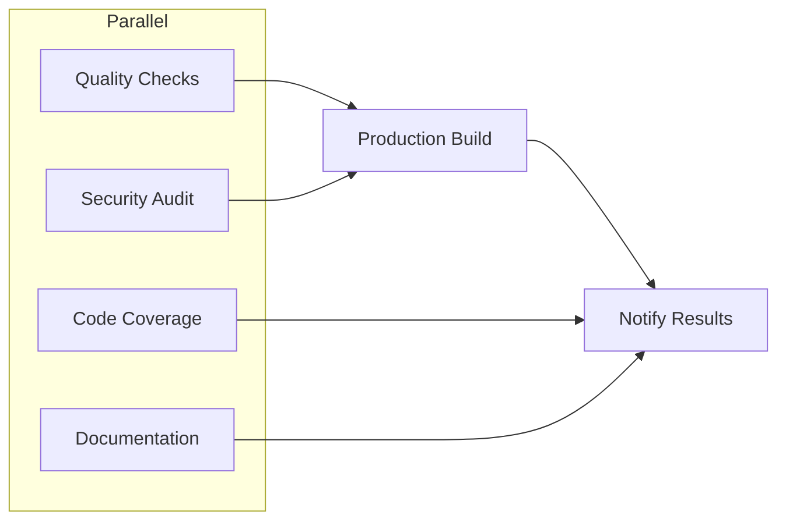

# 🔍 Análise DevSenior & DevOps — TokenMilagre Platform

```
🧠 Agent: ESTRUTURA + SEGURANCA
📡 Graphiti: online
📋 Contexto: Auditoria profunda de arquitetura, qualidade e operações
```

---

## 📊 Resumo Executivo

| Área | Score | Status |
|------|-------|--------|
| **Arquitetura** | 8.5/10 | ✅ Sólida |
| **CI/CD** | 9/10 | ✅ Excelente |
| **Qualidade de Código** | 7.5/10 | ⚠️ Bom, melhorias possíveis |
| **Segurança** | 8/10 | ✅ Boa |
| **DevOps** | 7/10 | ⚠️ Precisa atenção |
| **Testes** | 6/10 | ⚠️ Cobertura parcial |
| **Documentação** | 7.5/10 | ✅ Adequada |

**Score Geral: 7.6/10** 🟢

---

## 1. Stack Tecnológica

### ✅ Pontos Fortes

| Tecnologia | Versão | Avaliação |
|------------|--------|-----------|
| Next.js | 16.0.7 | 🟢 Cutting-edge |
| React | 19.1.0 | 🟢 Última versão estável |
| TypeScript | 5.9.3 | 🟢 Última versão |
| Prisma | 6.19.0 | 🟢 Atualizado |
| Node.js | 20.x | 🟢 LTS atual |
| Tailwind | 4.x | 🟢 Última versão |

**Conclusão:** Stack muito moderna e bem atualizada. Sem dívida técnica significativa em dependências core.

### ⚠️ Dependências de Atenção

| Pacote | Observação |
|--------|------------|
| `node-fetch@2.7.0` | Versão legacy, migrar para fetch nativo |
| `reflect-metadata` | Necessário para tsyringe DI |
| `novel` | Editor rico - avaliar se ainda usado |

---

## 2. CI/CD Pipeline

### 🎯 Arquitetura de Jobs



### ✅ Excelente Configuração

1. **6 Jobs Paralelos** — Execução otimizada
2. **Timeout Limits** — 10-15 min por job
3. **Security Audit** — Bloqueia em vulnerabilidades críticas
4. **Codecov Integration** — Métricas de cobertura em PRs
5. **Documentation Auto-Deploy** — GitHub Pages
6. **Build Size Monitoring** — Warning > 100MB

### ⚠️ Melhorias Sugeridas

| Problema | Impacto | Solução |
|----------|---------|---------|
| Lighthouse desabilitado | Performance não monitorada | Configurar CLERK_PUBLISHABLE_KEY em secrets |
| Sem E2E em CI | Regressões manuais | Adicionar Playwright job |
| Sem cache Docker | Builds mais lentos | Implementar layer caching |

---

## 3. Qualidade de Código

### 📁 Estrutura de Diretórios

```
lib/
├── core/         # Infraestrutura (Prisma, DI, Theme)
├── domains/      # Domínios de negócio
│   ├── admin-chat/
│   ├── articles/
│   ├── crypto/
│   ├── resources/
│   └── users/
├── services/     # Serviços compartilhados
├── schemas/      # Validação Zod
└── shared/       # Utilitários
```

### ✅ Pontos Fortes

- **Domain-Driven Design** aplicado corretamente
- **Separação de concerns** clara
- **Injeção de dependência** via tsyringe
- **Schema Prisma** bem documentado (567 linhas, 14 models)

### ⚠️ Problemas Identificados

| Arquivo | Problema | Severidade |
|---------|----------|------------|
| Scripts root | 15 scripts .ts no root `/scripts/` | 🟡 Médio |
| Arquivos grandes | `additional-resources.ts` (101KB) | 🔴 Alto |
| Seeds grandes | `seed-curiosities.ts` (72KB) | 🟡 Médio |

---

## 4. Configuração ESLint

### ✅ Bem Configurado

```javascript
// Plugin customizado para tema
"theme/no-hardcoded-colors": "warn"
```

**Ignores sensatos:** 
- `node_modules/**`, `.next/**`, `scripts/**`, `lib/generated/**`

### ⚠️ Melhorias Sugeridas

| Regra | Benefício |
|-------|-----------|
| `no-console` | Evitar logs em produção |
| `prefer-const` | Imutabilidade |
| `@typescript-eslint/no-explicit-any` | Type safety |

---

## 5. Sistema de Testes

### 📊 Métricas

| Métrica | Valor | Target |
|---------|-------|--------|
| Arquivos de teste | 288 | — |
| Coverage Threshold | 80% | 80% ✅ |
| Test Framework | Jest 30 | 🟢 |
| E2E Framework | Playwright | 🟢 |

### ✅ Bom Setup

- **MSW** para mocking de APIs
- **Testing Library** para componentes
- **Polyfills** configurados
- **Coverage por área**: `lib/services/**`, `lib/utils/**`, `hooks/**`

### ⚠️ Gaps de Cobertura

| Área | Status |
|------|--------|
| `lib/domains/articles/` | Parcial |
| `lib/domains/crypto/` | Parcial |
| `components/` | ❌ Não incluído no coverage |
| `app/` | ❌ Não incluído no coverage |

---

## 6. Banco de Dados (Prisma)

### 🎯 Schema Analysis

```
Models: 14
Migrations: 11
Engine: PostgreSQL 14
```

### ✅ Pontos Fortes

- **Indexes** bem definidos em campos de busca
- **Cascade deletes** configurados
- **Enums** para valores finitos
- **JSON fields** para dados flexíveis

### ⚠️ Atenção

| Modelo | Problema |
|--------|----------|
| `Article` | 30+ campos — considerar normalização |
| `Resource` | 25+ campos — muitos JSONs |
| `Like` | Constraints únicas múltiplas (article+resource) |

---

## 7. Scripts de Operação

### ✅ Excelente Sistema de Segurança

```bash
# db-safe.sh implementa:
1. Detecção de comandos destrutivos
2. Backup OBRIGATÓRIO antes de migrate reset
3. Confirmação interativa
4. Logs coloridos
```

### 📋 Scripts Disponíveis

| Script | Propósito |
|--------|-----------|
| `npm run db:backup` | Backup do banco |
| `npm run db:restore` | Restauração |
| `npm run db:safe` | Wrapper seguro |
| `npm run check:all` | Quality checks |
| `npm run audit:deps` | Auditoria de dependências |

---

## 8. DevOps — Gaps Críticos

### 🔴 Ausências Identificadas

| Item | Impacto | Prioridade |
|------|---------|------------|
| **Dockerfile** | Sem containerização local | 🔴 Alto |
| **docker-compose.yml** | Ambiente dev não replicável | 🔴 Alto |
| **Makefile** | Comandos longos demais | 🟡 Médio |
| **.env.development** | Separação de ambientes | 🟡 Médio |
| **Monitoring (Grafana/Prometheus)** | Sem observabilidade | 🟡 Médio |

### ⚠️ Deploy Atual

- **Vercel** — Configurado (`.vercel/`, `.vercelignore`)
- **Sem staging environment** documentado
- **Sentry** configurado para error tracking ✅

---

## 9. Recomendações Prioritárias

### 🔴 Alta Prioridade (Sprint Atual)

1. **Criar Dockerfile**
   ```dockerfile
   FROM node:20-slim
   WORKDIR /app
   COPY package*.json ./
   RUN npm ci --legacy-peer-deps
   COPY . .
   RUN npx prisma generate
   CMD ["npm", "run", "dev"]
   ```

2. **Criar docker-compose.yml**
   ```yaml
   services:
     app:
       build: .
       ports: ["3000:3000"]
     db:
       image: postgres:14
   ```

3. **Habilitar Playwright no CI**
   - Adicionar job `e2e` após `build`

### 🟡 Média Prioridade (Próximo Sprint)

4. **Particionar arquivos grandes**
   - `additional-resources.ts` → múltiplos arquivos por categoria

5. **Expandir coverage para `components/`**
   - Adicionar ao `collectCoverageFrom`

6. **Adicionar pre-commit hooks**
   - `husky` + `lint-staged` para validação local

### 🟢 Baixa Prioridade (Backlog)

7. **Migrar `node-fetch` para fetch nativo**
8. **Implementar health checks endpoint**
9. **Adicionar Lighthouse na CI**

---

## 10. Conclusão

### ✅ O que está funcionando bem

- **Stack moderna** e atualizada
- **CI/CD robusto** com múltiplos checks
- **Segurança de DB** exemplar (db-safe.sh)
- **DDD aplicado** corretamente
- **Sistema de agents** bem documentado

### ⚠️ O que precisa de atenção

- **Containerização** ausente
- **Testes E2E** não integrados ao CI
- **Arquivos monolíticos** de resources/seeds
- **Coverage** limitada a lib/

### 📈 Próximos Passos

1. Implementar Dockerfile + docker-compose
2. Adicionar Playwright ao CI
3. Refatorar arquivos > 50KB
4. Expandir coverage de testes

---

> **Análise realizada em:** 2025-12-31
> **Versão do projeto:** 0.1.0
> **Autor:** Agent ESTRUTURA + SEGURANCA
