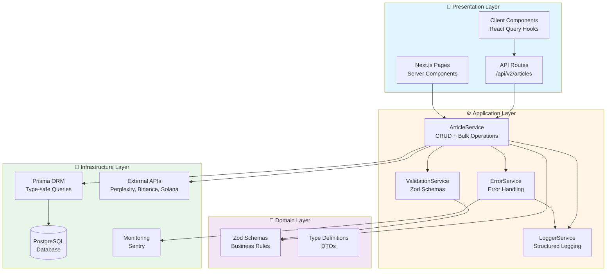
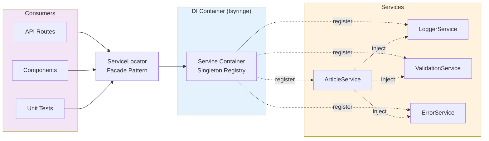

# 🌟 TokenMilagre Platform

**Plataforma educacional e de comunidade para o token $MILAGRE (Solana)**

[](https://vercel.com/new/clone?repository-url=https://github.com/dogespartano-cyber/tokenmilagre-platform)

---

## 🚦 Status Atual

**🟢 PRODUÇÃO ESTÁVEL** | **🔴 API v2 DESABILITADA (Migração Pendente)**

- ✅ **Sistema v1:** Totalmente funcional
- 🔴 **API v2:** Desabilitada até migração do schema ser concluída
- 📋 **Documentação:** [STATUS.md](./STATUS.md) | [MIGRATION_PLAN.md](./MIGRATION_PLAN.md)

⚠️ **Desenvolvedores:** Rotas `/api/v2/*` retornam HTTP 503. Use endpoints v1 até migração estar completa.

---

## 🚀 Quick Start

### Desenvolvimento Local

```bash
# Instalar dependências
npm install

# Gerar Prisma Client
npx prisma generate

# Rodar servidor de desenvolvimento
npm run dev

# Abrir http://localhost:3000
```

### Build para Produção

```bash
# Criar build otimizado
npm run build

# Rodar build localmente
npm start
```

## 🔧 Stack Tecnológico

### Core
- **Framework:** Next.js 15.5.4 (App Router + Turbopack)
- **Linguagem:** TypeScript 5.9.3 (strict mode)
- **Banco de Dados:** Neon PostgreSQL
- **ORM:** Prisma 6.19.0
- **Estilização:** Tailwind CSS 4 + CSS Variables
- **Blockchain:** Solana (via @solana/web3.js)
- **Deploy:** Vercel

### Novo Sistema de Artigos (v2)
- **Dependency Injection:** tsyringe + reflect-metadata
- **Validation:** Zod + isomorphic-dompurify (XSS prevention)
- **Logging:** Pino (structured JSON logging)
- **Monitoring:** Sentry (error tracking + performance)
- **Testing:** Jest + Playwright + Supertest + k6
- **State Management:** React Query (@tanstack/react-query)

**Coverage:** 98.87% (167 testes passando)

## ✨ Features Principais

### 🏠 Homepage
- Hero section com ticker de preços em tempo real
- Dados de mercado (Market Cap, Volume, Dominância BTC/ETH)
- Fear & Greed Index com velocímetro interativo
- Gráfico Bitcoin (TradingView Lightweight Charts)
- Últimas notícias (4 cards)
- Cards de artigos educacionais (carousel 2 slides)
- Ferramentas essenciais (MetaMask, Binance, Uniswap)
- Design minimalista com bordas sutis e sombras harmônicas

### 📚 Educação (`/educacao`)
- Artigos educacionais completos armazenados em PostgreSQL
- Sistema de filtros (Busca + Categorias + Níveis)
- Níveis: Iniciante (1), Intermediário (2), Avançado (3)
- Categorias: Blockchain, Trading, DeFi, NFTs, Segurança, Desenvolvimento
- Artigos com índice lateral e scroll tracking
- Compartilhamento social (Twitter, Telegram, WhatsApp)

### 🔗 Recursos (`/recursos`)
- Links oficiais verificados de ferramentas cripto
- Design com gradientes categorizados:
  - Wallets (laranja), Exchanges (dourado), DeFi (rosa)
  - Explorers (azul), Tools (verde)
- Sistema de busca e filtros por categoria
- Badge de verificação em todos os recursos
- Avisos de segurança destacados

### 📰 Notícias (`/dashboard/noticias`)
- Notícias armazenadas em PostgreSQL via Prisma
- Filtros combinados (Ordenação + Sentimento)
- Análise de sentimento (🟢 Positivo, 🟡 Neutro, 🔴 Negativo)
- Páginas dinâmicas `/dashboard/noticias/[slug]`
- Template com processamento automático (remove H1, fontes, adiciona nota de transparência)
- Índice lateral navegável

### 💝 Doações (`/doacoes`)
- 4 razões para confiar (Transparência, Sem Intermediários, Impacto Real, Comunidade)
- Distribuição de recursos (40% Educação, 30% Dev, 20% Apoio, 10% Crescimento)
- Métodos: Solana (SOL), $MILAGRE Token, PIX
- Botão copiar endereço com feedback visual
- Avisos de segurança

### 📜 Manifesto (`/manifesto`)
- Manifesto completo da comunidade $MILAGRE
- 12 seções com navegação lateral
- Sistema de scroll suave

### ℹ️ Sobre (`/sobre`)
- História e missão do projeto
- Valores da comunidade
- Links sociais e de contato

## 📁 Estrutura do Projeto

```
tokenmilagre-platform/
├── app/                          # Next.js App Router
│   ├── api/                      # API Routes
│   │   └── articles/             # API de artigos/notícias
│   ├── dashboard/                # Dashboard com sidebar
│   │   └── noticias/             # Sistema de notícias
│   │       ├── page.tsx          # Listagem
│   │       └── [slug]/           # Artigo individual
│   ├── educacao/                 # Artigos educacionais
│   │   ├── page.tsx              # Server Component (Prisma)
│   │   ├── EducacaoClient.tsx    # Client Component
│   │   └── [slug]/               # Artigo individual
│   ├── recursos/                 # Links e ferramentas
│   ├── doacoes/                  # Página de doações
│   ├── manifesto/                # Manifesto
│   ├── sobre/                    # Sobre o projeto
│   ├── page.tsx                  # Homepage
│   ├── layout.tsx                # Root layout
│   └── globals.css               # CSS global + variables
├── components/                   # Componentes React
│   ├── AdvancedChart.tsx         # Gráfico BTC com indicadores
│   ├── LightweightChart.tsx      # Charts profissionais
│   ├── TickerTapeWidget.tsx      # Ticker horizontal
│   ├── Sidebar.tsx               # Navegação lateral
│   ├── Header.tsx                # Header do site
│   └── ...                       # Outros componentes
├── contexts/                     # React Contexts
│   └── ThemeContext.tsx          # Tema claro/escuro
├── hooks/                        # Custom React Hooks
├── lib/                          # Bibliotecas e utilitários
│   ├── prisma.ts                 # Prisma Client singleton
│   └── generated/prisma/         # Prisma Client gerado
├── prisma/                       # Prisma ORM
│   ├── schema.prisma             # Schema do banco
│   └── seed.ts                   # Seed inicial
├── scripts/                      # Scripts utilitários
│   ├── check-*.js                # Scripts de verificação
│   ├── list-*.js                 # Scripts de listagem
│   ├── delete-*.js               # Scripts de remoção
│   └── watch-articles.js         # Watcher de artigos
├── public/                       # Assets estáticos
│   └── images/                   # Imagens
├── types/                        # TypeScript types
└── README.md                     # Este arquivo
```

## 🗄️ Banco de Dados

### PostgreSQL + Prisma

**Banco:** Neon PostgreSQL (Vercel Marketplace)
**Client:** `lib/generated/prisma` (caminho customizado)

```bash
# Gerar Prisma Client
npx prisma generate

# Aplicar mudanças no schema
npx prisma db push

# Abrir Prisma Studio
npm run db:studio
```

### Schema Principal

```prisma
model Article {
  id          String   @id @default(cuid())
  slug        String   @unique
  title       String
  excerpt     String
  content     String
  category    String
  tags        String   // JSON array
  sentiment   String?
  type        String   // 'news' | 'educational'
  level       String?  // 'iniciante' | 'intermediario' | 'avancado'
  contentType String?  // 'Artigo' | 'Tutorial'
  readTime    String?
  published   Boolean  @default(false)
  authorId    String
  createdAt   DateTime @default(now())
  updatedAt   DateTime @updatedAt

  author      User     @relation(fields: [authorId], references: [id])
}
```

## 🏗️ Novo Sistema de Artigos (v2)

### Arquitetura Limpa

O novo sistema segue **Clean Architecture** em 4 camadas:



### Dependency Injection (DI)

O sistema utiliza **tsyringe** para injeção de dependências, garantindo singleton pattern e fácil testabilidade:



### Services Core

```typescript
// Dependency Injection com tsyringe
import { ServiceLocator } from '@/lib/di/container'

// 1. LoggerService - Structured logging
const logger = ServiceLocator.getLogger()
logger.info('Article created', { articleId: 'art-123' })

// 2. ValidationService - Zod validation + sanitization
const validation = ServiceLocator.getValidation()
const validated = validation.validate(articleCreateSchema, data)
const slug = validation.generateSlug('Bitcoin Atinge US$ 100 mil!')

// 3. ErrorService - Type-safe error handling
import { ValidationError, NotFoundError, errorHandler } from '@/lib/services/error-service'
throw new NotFoundError('Artigo não encontrado', { articleId: id })

// 4. ArticleService - CRUD completo
const articleService = ServiceLocator.getArticle()

// Create
const article = await articleService.create({
  title: 'Bitcoin Atinge US$ 100 mil',
  slug: 'bitcoin-100k',
  content: '<p>Conteúdo...</p>',
  type: 'NEWS',
  categoryId: 'cat-123',
  authorId: 'user-123',
  tagIds: ['tag-1', 'tag-2'],
  status: 'DRAFT',
}, 'user-123')

// Read
const article = await articleService.getBySlug('bitcoin-100k')
const result = await articleService.list({ page: 1, limit: 10, type: 'NEWS' })

// Update
await articleService.update(id, { title: 'Novo Título' }, 'user-123')

// Delete (soft)
await articleService.delete(id, 'user-123')

// Bulk operations
await articleService.bulkOperation({
  articleIds: ['art-1', 'art-2'],
  operation: 'publish', // publish | archive | delete | restore
}, 'user-123')
```

### Schema Prisma v2

Novo schema otimizado com relações type-safe:

```prisma
// Categories (tabela separada)
model Category {
  id       String @id @default(cuid())
  slug     String @unique
  name     String
  type     String // 'news' | 'educational' | 'resource'
  articles Article[]
}

// Tags (M:N via pivot)
model Tag {
  id       String @id @default(cuid())
  slug     String @unique
  name     String
  articles ArticleTag[]
}

model ArticleTag {
  articleId String
  tagId     String
  article   Article @relation(fields: [articleId], references: [id])
  tag       Tag     @relation(fields: [tagId], references: [id])
  @@id([articleId, tagId])
}

// Citations (fact-checking)
model Citation {
  id        String @id @default(cuid())
  url       String
  title     String?
  domain    String?
  articleId String
  article   Article @relation(fields: [articleId], references: [id])
  verified  Boolean @default(false)
}

// Article (otimizado)
model Article {
  // ... campos básicos
  tags         ArticleTag[]
  citations    Citation[]
  relatedFrom  ArticleRelation[] @relation("ArticleToRelated")

  // 8 composite indexes para performance
  @@index([type, status, publishedAt])
  @@index([type, categoryId, status])
}
```

### Guias de Uso

- **📖 Arquitetura:** [`docs/NEW_SYSTEM_ARCHITECTURE.md`](docs/NEW_SYSTEM_ARCHITECTURE.md)
- **🚀 Onboarding:** [`ONBOARDING.md`](ONBOARDING.md)
- **💉 DI Examples:** [`lib/di/examples.md`](lib/di/examples.md)
- **📝 Changelog:** [`CHANGELOG.md`](CHANGELOG.md)
- **🧪 Test Plan:** [`docs/TEST_PLAN.md`](docs/TEST_PLAN.md)

### Testes

```bash
# Rodar todos os testes
npm test

# Teste específico
npm test -- lib/services/__tests__/article-service.test.ts

# Coverage report
npm test -- --coverage
```

**Resultado atual:**
- ✅ 167 testes (100% passando)
- ✅ 98.87% coverage
- ✅ ErrorService: 100%
- ✅ ValidationService: 98.03%
- ✅ ArticleService: 98.58%
- ✅ LoggerService: 98.3%
- ✅ DI Container: 100%

### Migration Status

⚠️ **Sistema em Paralelo**: O novo sistema roda em paralelo ao antigo. As 3 páginas existentes (`gerar-em-massa`, `criar-artigo`, `artigos`) **NÃO foram modificadas** e continuam funcionando normalmente.

**Roadmap:**
- ✅ Semana 1-2: Infrastructure + Services Core + DI (CONCLUÍDO)
- ⏳ Semana 3: APIs v2 + React Query hooks
- ⏳ Semana 4: E2E + Load tests
- ⏳ Semana 5-6: Migration + Monitoring

## 🔌 APIs e Integrações

### Blockchain
- **Solana Web3.js**: Conexão com blockchain Solana
- **Token Address**: `3tpz3ar7gaHmPZfhWHzRdPnBJ5MrZZVDxepDtDLYpump`

### Dados de Mercado
- **Binance API**: Candlesticks e volume em tempo real
- **CoinGecko API**: Market cap, volume, dominância
- **Alternative.me API**: Fear & Greed Index
- **TradingView**: Gráficos embarcados

## 📝 Configuração

### Variáveis de Ambiente

Crie `.env` na raiz do projeto (copiar de `.env.example`):

```bash
# Database (Neon PostgreSQL)
DATABASE_URL="postgresql://..."
DIRECT_URL="postgresql://..."

# Solana
NEXT_PUBLIC_SOLANA_NETWORK=mainnet-beta
NEXT_PUBLIC_TOKEN_ADDRESS=3tpz3ar7gaHmPZfhWHzRdPnBJ5MrZZVDxepDtDLYpump
```

### Scripts Disponíveis

```bash
# Desenvolvimento
npm run dev              # Dev server (Turbopack)
npm run build            # Build produção
npm start                # Rodar build

# Banco de Dados
npm run db:push          # Aplicar schema
npm run db:studio        # Prisma Studio
npm run db:seed          # Seed inicial

# Utilitários
npm run lint             # ESLint
npm run watch            # Watcher de artigos
```

## 🚀 Deploy

### Vercel (Recomendado)

1. Conecte o repositório GitHub à Vercel
2. Integre Neon PostgreSQL via Vercel Marketplace
3. Variáveis de ambiente são configuradas automaticamente
4. Deploy automático a cada push em `main`

**IMPORTANTE**:
- Manter script `postinstall: "prisma generate"` no package.json
- Configurar `eslint.ignoreDuringBuilds: true` no next.config.ts

## 🎨 Design System

### CSS Variables

Modo claro e escuro via CSS Variables:

```css
--text-primary, --text-secondary, --text-tertiary
--bg-primary, --bg-secondary, --bg-elevated
--brand-primary, --brand-hover
--border-light, --border-medium
--shadow-md, --shadow-lg
```

### Padrões

- **Bordas**: 1px quase invisíveis (`--border-light`)
- **Sombras**: Sutis e harmônicas
- **Hover**: `-translate-y-1` + `shadow-lg`
- **Transições**: `duration-500 ease-out`
- **Fundo claro**: `#f5f4f6` (off-white confortável)

## 🛠️ Scripts Utilitários

### 🔧 Automação (scripts/utils/)
- **`lint-changed.sh`** - Lint/type-check apenas em arquivos alterados
- **`backup-db.sh`** - Backup e restore automático de banco (local/staging)
- **`check-env.sh`** - Sanity check de variáveis de ambiente obrigatórias

### ✅ Qualidade (scripts/quality/)
- **`run-all-checks.sh`** - Executa todos os checks de qualidade (lint, tests, build)
- **`check-schema-integrity.ts`** - Valida integridade do schema do banco

### 📋 Verificação
- `check-article-content.js` - Valida conteúdo
- `check-duplicates.js` - Verifica duplicatas
- `check-educational.js` - Verifica artigos educacionais

### 📊 Listagem
- `list-articles.js` - Lista todos os artigos
- `list-users.js` - Lista usuários do sistema

### 🔨 Outros
- `count-articles.js` - Conta artigos por tipo
- `delete-article.js` - Remove artigo do banco
- `test-api-sentiment.js` - Testa API de sentimento
- `watch-articles.js` - Watcher de mudanças

### 📖 Documentação
Ver documentação completa em:
- **Scripts utilitários:** `scripts/utils/README.md`
- **Scripts gerais:** `scripts/README.md`

## 🔗 Links Importantes

- **Token Contract**: [3tpz3ar7gaHmPZfhWHzRdPnBJ5MrZZVDxepDtDLYpump](https://solscan.io/token/3tpz3ar7gaHmPZfhWHzRdPnBJ5MrZZVDxepDtDLYpump)
- **Discord**: [discord.gg/xk4zrz8j](https://discord.gg/xk4zrz8j)
- **Telegram**: [t.me/+Bop_TVFc_mg3Njlh](https://t.me/+Bop_TVFc_mg3Njlh)
- **Pump.fun**: [pump.fun/coin/3tpz3ar7gaHmPZfhWHzRdPnBJ5MrZZVDxepDtDLYpump](https://pump.fun/coin/3tpz3ar7gaHmPZfhWHzRdPnBJ5MrZZVDxepDtDLYpump)

## 📜 Licença

© 2025 by $MILAGRE Community. Projeto 100% comunitário e sem fins lucrativos.

---

**Nunca estarás sozinho. ❤️**

*Desenvolvido com Claude Code & Next.js*
