# 🏗️ Arquitetura do Token Milagre Platform

**Versão:** 2.0.0
**Última Atualização:** 2025-11-19
**Status:** ✅ Produção

---

## 📋 Índice

1. [Visão Geral](#visão-geral)
2. [Clean Architecture](#clean-architecture)
3. [Fluxo de Requisição](#fluxo-de-requisição)
4. [Dependency Injection](#dependency-injection)
5. [Services Core](#services-core)
6. [Padrões de Código](#padrões-de-código)
7. [Segurança](#segurança)
8. [Performance e Cache](#performance-e-cache)
9. [Monitoramento](#monitoramento)

---

## 🎯 Visão Geral

### Princípios Arquiteturais

O Token Milagre Platform segue os princípios de **Clean Architecture** e **Domain-Driven Design**:

- **Separation of Concerns:** Cada camada tem responsabilidades bem definidas
- **Dependency Inversion:** Dependências apontam para abstrações, não implementações
- **Single Responsibility:** Cada módulo/classe tem uma única responsabilidade
- **DRY (Don't Repeat Yourself):** Código reutilizável via services e helpers
- **Type Safety:** 100% TypeScript com validação Zod

### Stack Tecnológico

```mermaid
graph TB
    subgraph Frontend["Frontend"]
        Next[Next.js 15.5.4<br/>App Router + Turbopack]
        React[React 19.1.0<br/>Server & Client Components]
        TailwindCSS[Tailwind CSS 4<br/>Styling]
        ReactQuery[@tanstack/react-query<br/>State Management]
    end

    subgraph Backend["Backend"]
        NextAPI[Next.js API Routes<br/>Serverless Functions]
        Prisma[Prisma 6.19.0<br/>ORM]
        DI[tsyringe<br/>Dependency Injection]
    end

    subgraph Database["Database"]
        PostgreSQL[(Neon PostgreSQL<br/>Database)]
    end

    subgraph External["External Services"]
        Solana[Solana Web3.js<br/>Blockchain]
        Binance[Binance API<br/>Market Data]
        Perplexity[Perplexity AI<br/>Content Generation]
        Sentry[Sentry<br/>Error Tracking]
    end

    React --> Next
    Next --> NextAPI
    NextAPI --> DI
    DI --> Prisma
    Prisma --> PostgreSQL
    NextAPI --> External

    style Frontend fill:#e3f2fd
    style Backend fill:#fff3e0
    style Database fill:#e8f5e9
    style External fill:#fce4ec
```

---

## 🏛️ Clean Architecture

### Arquitetura em 4 Camadas

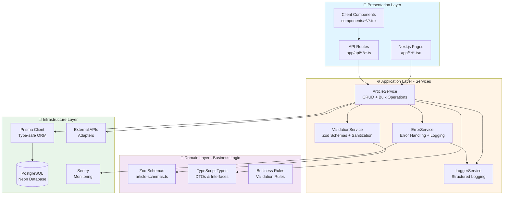

### Responsabilidades das Camadas

#### 🎨 Presentation Layer
- **Responsabilidade:** Interface com o usuário e entrada de dados
- **Tecnologias:** Next.js App Router, React Components
- **Regras:**
  - Não contém lógica de negócio
  - Apenas validação básica de UI (UX)
  - Chama services via DI container
  - Trata respostas e exibe ao usuário

#### ⚙️ Application Layer (Services)
- **Responsabilidade:** Orquestração de casos de uso
- **Tecnologias:** TypeScript Classes, tsyringe
- **Regras:**
  - Contém toda a lógica de negócio
  - Services são singleton (DI container)
  - Validação server-side obrigatória
  - Logging estruturado em todas as operações

#### 💼 Domain Layer
- **Responsabilidade:** Regras de negócio e definições de tipos
- **Tecnologias:** Zod, TypeScript
- **Regras:**
  - Schemas Zod como fonte de verdade
  - Regras de validação centralizadas
  - Independente de frameworks

#### 🔧 Infrastructure Layer
- **Responsabilidade:** Acesso a dados e serviços externos
- **Tecnologias:** Prisma, Fetch API, Sentry
- **Regras:**
  - Adapters para APIs externas
  - Type-safe database queries
  - Tratamento de erros de infraestrutura

---

## 🔄 Fluxo de Requisição

### Fluxo Completo (Create Article)

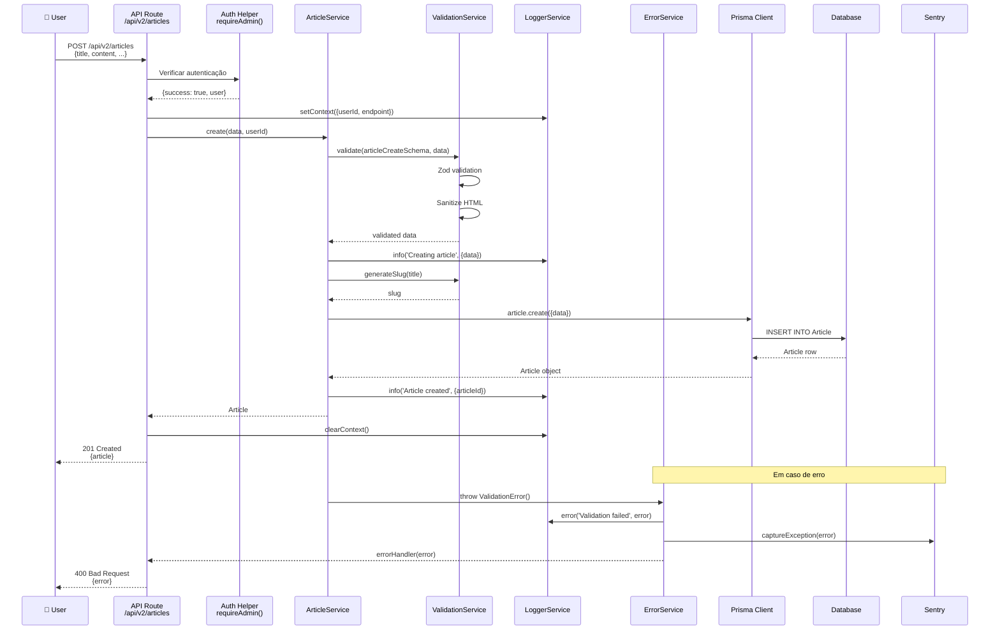

### Fluxo de Autenticação

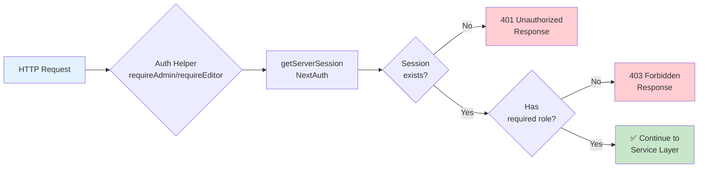

### Fluxo de Validação

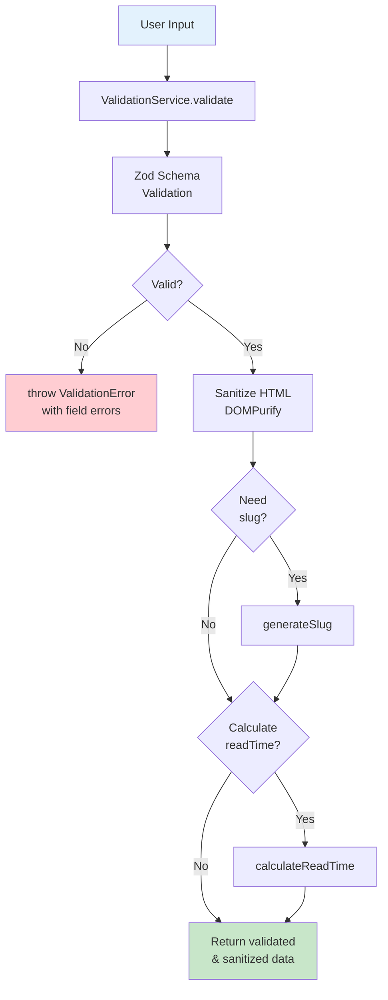

---

## 💉 Dependency Injection

### DI Container Architecture

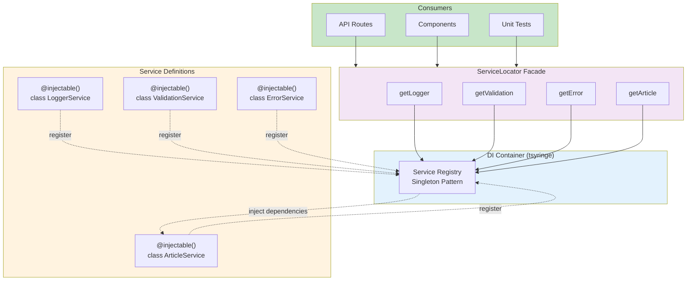

### Exemplo de Uso

```typescript
// ❌ NÃO FAZER - Instanciar diretamente
const service = new ArticleService(prisma, logger, validation)

// ✅ FAZER - Usar DI Container
import { ServiceLocator } from '@/lib/di/container'

const articleService = ServiceLocator.getArticle()
const logger = ServiceLocator.getLogger()
const validation = ServiceLocator.getValidation()
```

### Benefícios

- **Singleton Garantido:** Cada service tem uma única instância
- **Testabilidade:** Fácil mock de dependências
- **Type Safety:** Autocomplete e validação TypeScript
- **Desacoplamento:** Serviços não conhecem implementação dos outros
- **Manutenibilidade:** Mudanças em dependências não quebram código

---

## 🔧 Services Core

### Hierarquia de Services

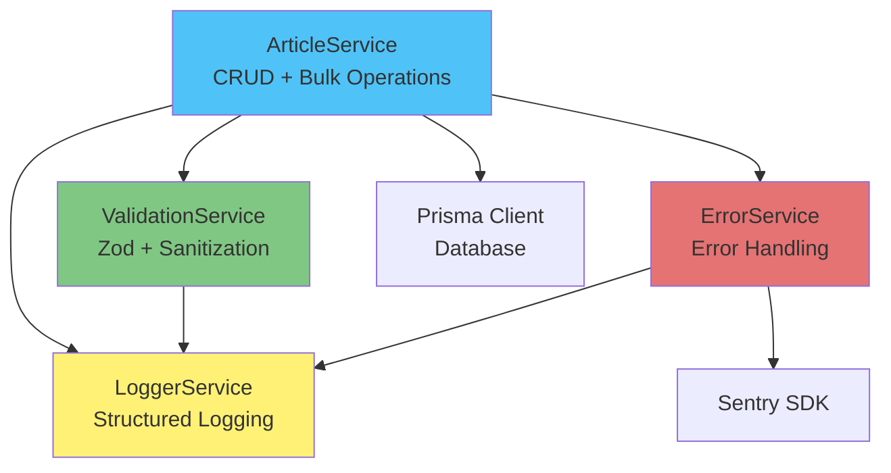

### LoggerService

**Responsabilidade:** Logging estruturado em JSON com contexto rico

```typescript
// Configuração de contexto
logger.setContext({ userId: 'user-123', endpoint: '/api/articles' })

// Logging em diferentes níveis
logger.debug('Processing request', { filters })
logger.info('Article created', { articleId: 'art-456' })
logger.warn('Slow query detected', { duration: 1500 })
logger.error('Validation failed', error, { field: 'title' })

// Limpeza de contexto
logger.clearContext()

// Medição de performance
const result = await measureTime(
  () => articleService.create(data, userId),
  'article.create',
  { userId }
)
```

**Output Example:**
```json
{
  "timestamp": "2025-11-19T10:30:00.123Z",
  "level": "info",
  "message": "Article created",
  "context": {
    "userId": "user-123",
    "endpoint": "/api/articles"
  },
  "metadata": {
    "articleId": "art-456"
  }
}
```

### ValidationService

**Responsabilidade:** Validação server-side e sanitização

```typescript
// Validação com Zod (throws ValidationError se inválido)
const validated = validation.validate(articleCreateSchema, data)

// Validação segura (retorna result object)
const result = validation.validateSafe(articleCreateSchema, data)
if (!result.success) {
  console.log(result.errors.fieldErrors)
}

// Utilitários
const slug = validation.generateSlug('Bitcoin Atinge US$ 100 mil!')
const readTime = validation.calculateReadTime(content) // minutos
const safeHtml = validation.sanitizeHtml(content) // XSS prevention
```

### ErrorService

**Responsabilidade:** Hierarquia de erros type-safe

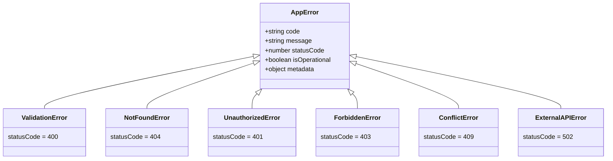

```typescript
// Lançar erros específicos
throw new ValidationError('Email inválido', { field: 'email' })
throw new NotFoundError('Artigo não encontrado', { articleId: '123' })
throw new UnauthorizedError('Token expirado')

// Uso em API routes
export async function POST(request: Request) {
  try {
    const article = await articleService.create(data, userId)
    return NextResponse.json(article, { status: 201 })
  } catch (error) {
    return errorHandler(error) // Auto-logs + Sentry + proper response
  }
}
```

### ArticleService

**Responsabilidade:** CRUD completo + operações em lote

**Métodos Principais:**

```typescript
// Create
create(data: ArticleCreateInput, userId: string): Promise<Article>

// Read
getById(id: string): Promise<Article | null>
getBySlug(slug: string): Promise<Article | null>
list(filters: ArticleFilters): Promise<PaginatedResult<Article>>

// Update
update(id: string, data: ArticleUpdateInput, userId: string): Promise<Article>

// Delete (soft delete)
delete(id: string, userId: string): Promise<void>
restore(id: string, userId: string): Promise<Article>

// Bulk operations
bulkOperation(params: BulkOperationParams, userId: string): Promise<number>

// Stats
getStats(): Promise<ArticleStats>
```

---

## 📐 Padrões de Código

### Adapter Pattern (External APIs)

Todas as APIs externas são encapsuladas em adapters:

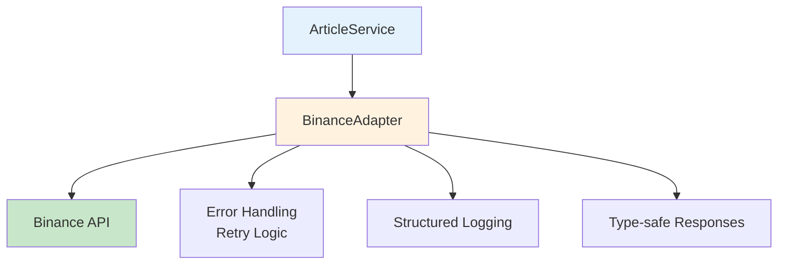

**Adapters Implementados:**
- `lib/adapters/binance-adapter.ts` - Binance market data
- `lib/adapters/perplexity-adapter.ts` - Perplexity AI
- `lib/adapters/solana-adapter.ts` - Solana blockchain

### Repository Pattern (Prisma)

```typescript
// Services interagem com Prisma Client via abstração
class ArticleService {
  constructor(
    private prisma: PrismaClient,
    private logger: LoggerService,
    private validation: ValidationService
  ) {}

  async create(data: ArticleCreateInput, userId: string): Promise<Article> {
    // Business logic
    const validated = this.validation.validate(articleCreateSchema, data)

    // Repository pattern - Prisma
    const article = await this.prisma.article.create({
      data: validated,
      include: { tags: true, category: true }
    })

    return article
  }
}
```

### Response Helpers Pattern

```typescript
// Padronização de respostas
import {
  successResponse,
  errorResponse,
  paginatedResponse,
  notFoundResponse
} from '@/lib/helpers/response-helpers'

// Success
return successResponse(article, 201)
// => { success: true, data: article, timestamp: '...' }

// Error
return errorResponse('Validation failed', 400)
// => { success: false, error: { message: '...', code: 'VALIDATION_ERROR' }, timestamp: '...' }

// Paginated
return paginatedResponse(articles, total, page, limit)
// => { success: true, data: articles, pagination: {...}, timestamp: '...' }
```

---

## 🔒 Segurança

### Camadas de Segurança

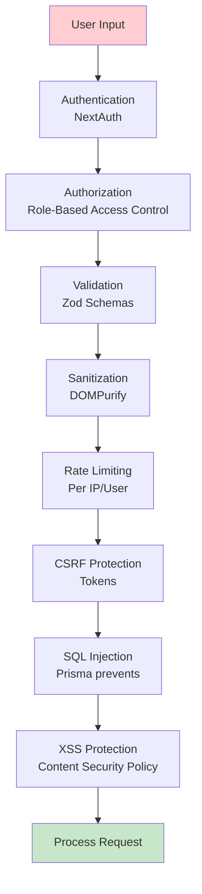

### Práticas de Segurança

1. **Input Validation (Zod):** Validação server-side obrigatória
2. **Sanitization (DOMPurify):** Remoção de scripts maliciosos
3. **Authentication (NextAuth):** Sessões seguras
4. **Authorization (RBAC):** Controle de acesso por role
5. **Rate Limiting:** Proteção contra DoS
6. **CSRF Tokens:** Proteção contra Cross-Site Request Forgery
7. **SQL Injection:** Prisma ORM com prepared statements
8. **XSS Protection:** Content Security Policy headers

---

## ⚡ Performance e Cache

### Estratégia de Cache

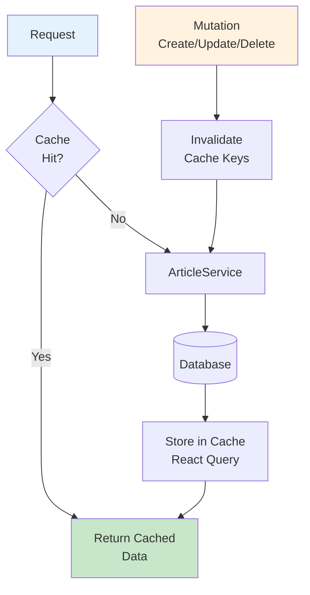

**Configuração React Query:**

```typescript
const cacheConfig = {
  articles: {
    staleTime: 5 * 60 * 1000,  // 5 min
    cacheTime: 30 * 60 * 1000, // 30 min
  },
  article: {
    staleTime: 10 * 60 * 1000, // 10 min
    cacheTime: 60 * 60 * 1000, // 1 hour
  }
}
```

---

## 📊 Monitoramento

### Observabilidade

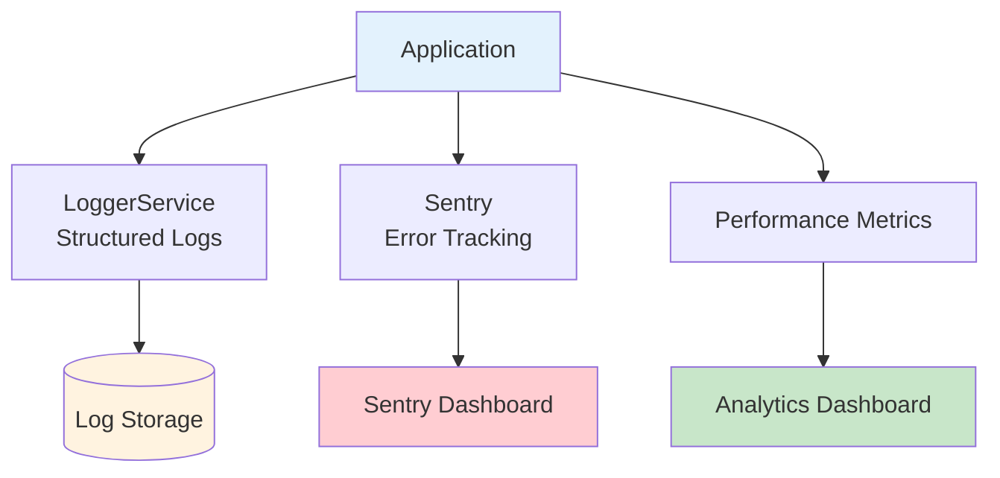

**Métricas Monitoradas:**
- Request latency (p50, p95, p99)
- Error rate por endpoint
- Cache hit rate
- Database query performance
- External API response times

---

## 📚 Referências

- **Clean Architecture:** [REFACTORING_GUIDE.md](REFACTORING_GUIDE.md)
- **API Specification:** [API_V2_SPECIFICATION.md](API_V2_SPECIFICATION.md)
- **Testing Guide:** [TEST_PLAN.md](TEST_PLAN.md)
- **Logging & Monitoring:** [LOGGING_MONITORING.md](LOGGING_MONITORING.md)
- **DI Examples:** [../lib/di/examples.md](../lib/di/examples.md)

---

**Última Atualização:** 2025-11-19
**Mantenedor:** Time de Desenvolvimento Token Milagre
