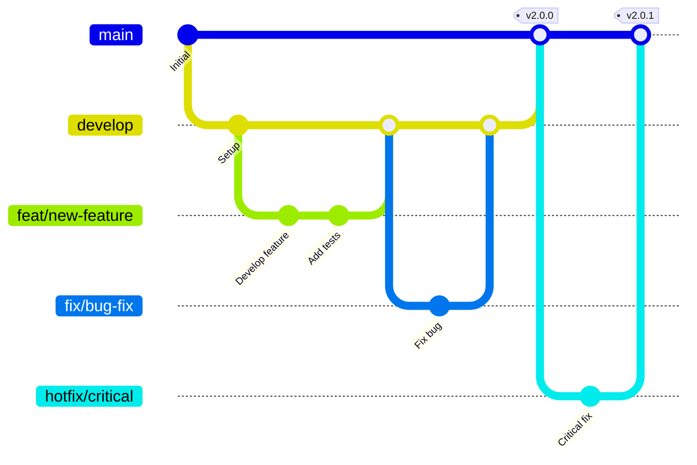
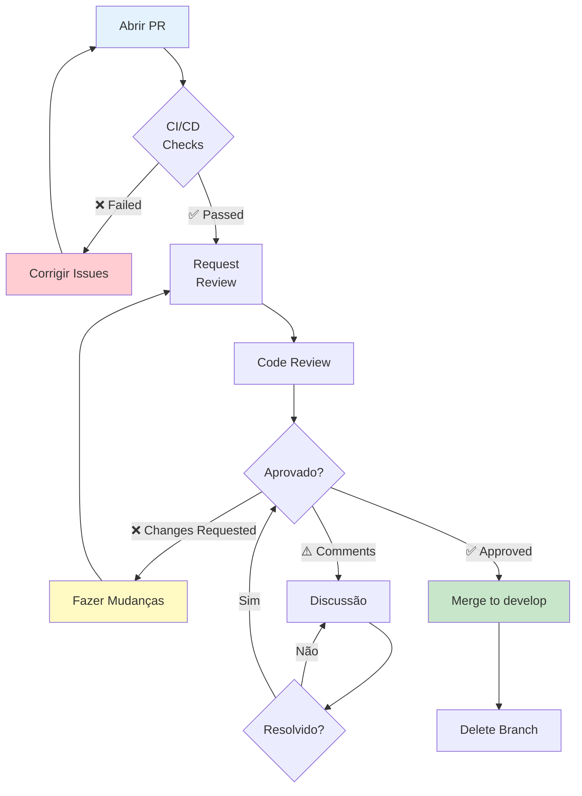

# 🤝 Guia de Contribuição - Token Milagre Platform

Obrigado por contribuir com o Token Milagre Platform! Este guia ajuda você a entender nosso processo de desenvolvimento e padrões da equipe.

---

## 📋 Índice

1. [Código de Conduta](#código-de-conduta)
2. [Como Contribuir](#como-contribuir)
3. [Fluxo de Trabalho Git](#fluxo-de-trabalho-git)
4. [Pull Request Process](#pull-request-process)
5. [Code Review](#code-review)
6. [Padrões de Qualidade](#padrões-de-qualidade)
7. [Comunicação](#comunicação)

---

## 📜 Código de Conduta

### Nossos Valores

- **Respeito:** Tratamos todos com respeito e profissionalismo
- **Colaboração:** Trabalhamos juntos para alcançar os melhores resultados
- **Transparência:** Comunicação aberta e honesta
- **Excelência:** Buscamos sempre a qualidade máxima
- **Aprendizado:** Todos estão sempre aprendendo

### Comportamento Esperado

✅ **Seja respeitoso** com opiniões diferentes
✅ **Seja construtivo** em feedbacks
✅ **Seja paciente** com novos contribuidores
✅ **Seja colaborativo** e ajude outros
✅ **Seja profissional** em todas as interações

❌ **Não tolere** comportamento tóxico
❌ **Não faça** ataques pessoais
❌ **Não use** linguagem ofensiva
❌ **Não compartilhe** informações privadas sem permissão

---

## 🚀 Como Contribuir

### Tipos de Contribuição

Você pode contribuir de várias formas:

1. **🐛 Reportar Bugs**
   - Abra uma issue descrevendo o bug
   - Inclua passos para reproduzir
   - Adicione screenshots se possível

2. **✨ Sugerir Features**
   - Abra uma issue descrevendo a feature
   - Explique o caso de uso
   - Discuta alternativas

3. **📝 Melhorar Documentação**
   - Correções de typos
   - Clarificações
   - Novos exemplos
   - Traduções

4. **💻 Contribuir com Código**
   - Bug fixes
   - Novas features
   - Refatorações
   - Performance improvements
   - Testes

5. **🎨 Melhorias de UI/UX**
   - Design improvements
   - Acessibilidade
   - Responsividade

### Encontrando Issues para Trabalhar

**Labels úteis:**
- `good first issue` - Ideal para novos contribuidores
- `help wanted` - Precisamos de ajuda
- `bug` - Correção de bugs
- `enhancement` - Novas funcionalidades
- `documentation` - Melhorias na documentação

```bash
# Ver issues com label "good first issue"
# https://github.com/dogespartano-cyber/tokenmilagre-platform/issues?q=is%3Aissue+is%3Aopen+label%3A%22good+first+issue%22
```

---

## 🌿 Fluxo de Trabalho Git

### Branch Strategy

Usamos **Git Flow** simplificado:



### Branches Principais

| Branch | Propósito | Proteção |
|--------|-----------|----------|
| `main` | Código em produção | ✅ Protected |
| `develop` | Integração de features | ✅ Protected |
| `feat/*` | Novas funcionalidades | ❌ Ephemeral |
| `fix/*` | Correções de bugs | ❌ Ephemeral |
| `hotfix/*` | Correções urgentes | ❌ Ephemeral |

### Workflow Passo a Passo

#### 1. Sincronizar com o Repositório

```bash
# Atualizar main/develop
git checkout develop
git pull origin develop
```

#### 2. Criar Nova Branch

```bash
# Nomenclatura: tipo/descricao-curta
git checkout -b feat/article-bulk-delete
```

**Tipos de branch:**
- `feat/` - Nova funcionalidade
- `fix/` - Correção de bug
- `docs/` - Documentação
- `refactor/` - Refatoração
- `test/` - Testes
- `chore/` - Manutenção

#### 3. Desenvolver

```bash
# Fazer mudanças
# Commitar frequentemente com mensagens descritivas

git add .
git commit -m "feat(articles): Add bulk delete operation"

# Continue desenvolvendo...
git commit -m "test(articles): Add bulk delete tests"
git commit -m "docs(articles): Update API documentation"
```

#### 4. Manter Branch Atualizada

```bash
# Periodicamente, sync com develop
git checkout develop
git pull origin develop
git checkout feat/article-bulk-delete
git rebase develop

# Resolver conflitos se necessário
# git add .
# git rebase --continue
```

#### 5. Push e Abrir PR

```bash
# Push para remote
git push -u origin feat/article-bulk-delete

# Abrir PR no GitHub
# https://github.com/dogespartano-cyber/tokenmilagre-platform/compare
```

---

## 🔄 Pull Request Process

### Antes de Abrir o PR

**Checklist obrigatório:**

```bash
# 1. Testes passam
npm test
# ✅ 167/167 tests passed

# 2. Type check passa
npm run type-check
# ✅ No errors

# 3. Lint passa
npm run lint
# ✅ No warnings or errors

# 4. Build funciona
npm run build
# ✅ Build successful

# 5. Coverage mantido (se aplicável)
npm test -- --coverage
# ✅ Coverage: 98%+
```

**Se algum check falhar, NÃO abra o PR!**

### Template de PR

Use o template abaixo ao abrir um PR:

```markdown
## 📝 Descrição

Breve descrição das mudanças realizadas.

Fixes #123 (se aplicável)

## 🎯 Tipo de Mudança

- [ ] 🐛 Bug fix (correção de bug sem breaking changes)
- [ ] ✨ Nova feature (funcionalidade sem breaking changes)
- [ ] 💥 Breaking change (mudança que quebra compatibilidade)
- [ ] 📝 Documentação (apenas documentação)
- [ ] ♻️ Refatoração (mudança de código sem alterar funcionalidade)
- [ ] ⚡ Performance (melhoria de performance)
- [ ] 🎨 UI/UX (melhorias visuais)
- [ ] 🧪 Testes (adição ou correção de testes)

## 🧪 Como Testar

1. Passo 1
2. Passo 2
3. Resultado esperado

## 📸 Screenshots (se aplicável)

<!-- Adicione screenshots ou GIFs das mudanças visuais -->

## ✅ Checklist

- [ ] Code self-reviewed
- [ ] Comentários adicionados em código complexo
- [ ] Documentação atualizada
- [ ] Testes adicionados/atualizados
- [ ] Todos os testes passam
- [ ] Build funciona
- [ ] Lint passa
- [ ] Type check passa
- [ ] Breaking changes documentados (se aplicável)

## 📚 Documentação Relacionada

- Link para issue relacionada
- Link para documentação atualizada
- Link para design/mockup (se aplicável)
```

### Estrutura do PR

**Título:**
```
tipo(escopo): Descrição curta

# Exemplos:
feat(articles): Add bulk delete operation
fix(auth): Resolve session timeout after 1 hour
docs(readme): Update architecture diagrams
```

**Descrição:**
- O que foi mudado?
- Por que foi mudado?
- Como foi implementado?
- Qual o impacto?

**Labels:**
- Adicione labels apropriados (`bug`, `enhancement`, `documentation`, etc)

---

## 👀 Code Review

### Processo de Review



### O que Revisores Procuram

**✅ Code Quality**
- [ ] Código limpo e legível
- [ ] Nomes descritivos (variáveis, funções, classes)
- [ ] Funções pequenas e focadas
- [ ] DRY - sem duplicação
- [ ] SOLID principles

**✅ Funcionalidade**
- [ ] Código faz o que promete
- [ ] Edge cases tratados
- [ ] Erros tratados apropriadamente
- [ ] Validações server-side

**✅ Testes**
- [ ] Testes unitários adicionados
- [ ] Testes cobrem edge cases
- [ ] Testes são legíveis
- [ ] Coverage mantido (>80%)

**✅ Performance**
- [ ] Sem queries N+1
- [ ] Uso eficiente de memória
- [ ] Sem loops desnecessários
- [ ] Operações assíncronas otimizadas

**✅ Segurança**
- [ ] Validação de inputs
- [ ] Sanitização de HTML
- [ ] Sem SQL injection
- [ ] Sem XSS vulnerabilities
- [ ] Autenticação/autorização apropriadas

**✅ Documentação**
- [ ] JSDoc em funções públicas
- [ ] README atualizado (se necessário)
- [ ] Comentários em código complexo
- [ ] API docs atualizados (se aplicável)

### Como Responder a Feedbacks

**DO ✅:**
- Agradeça pelo feedback
- Faça perguntas se não entender
- Discuta alternativas construtivamente
- Implemente mudanças ou explique por que não

**DON'T ❌:**
- Leve para o pessoal
- Ignore comentários
- Discuta agressivamente
- Merge sem resolver comentários

**Exemplo de resposta:**
```markdown
> Sugestão: Esta validação poderia ser movida para o ValidationService

Ótima sugestão! Faz sentido centralizar essa lógica.
Vou refatorar isso. ✅

---

> Esta função está muito grande (150 linhas)

Você está certo. Vou quebrar em funções menores:
- extractArticleData()
- validateArticleData()
- saveArticle()

Atualizo em alguns minutos. 👍
```

### Aprovação e Merge

**Requisitos para Merge:**
- ✅ Pelo menos 1 aprovação de reviewer
- ✅ Todos os checks de CI/CD passando
- ✅ Todos os comentários resolvidos
- ✅ Branch atualizada com `develop`
- ✅ Sem conflitos

**Estratégia de Merge:**
- **Squash and merge** (padrão) - Para features pequenas
- **Merge commit** - Para features grandes com histórico importante
- **Rebase and merge** - Para manter histórico linear (opcional)

---

## 📊 Padrões de Qualidade

### Coverage Requirements

| Tipo | Mínimo | Ideal | Atual |
|------|--------|-------|-------|
| **Statements** | 80% | 90% | 98.87% |
| **Branches** | 75% | 85% | 95.45% |
| **Functions** | 80% | 90% | 98.33% |
| **Lines** | 80% | 90% | 98.91% |

**⚠️ PRs que reduzem coverage abaixo de 80% serão rejeitados!**

### Performance Benchmarks

| Métrica | Target | Verificação |
|---------|--------|-------------|
| **LCP** | < 2.5s | Lighthouse |
| **FID** | < 100ms | Lighthouse |
| **CLS** | < 0.1 | Lighthouse |
| **TTI** | < 3.5s | Lighthouse |
| **Build Time** | < 90s | CI/CD |

### Code Complexity

**Máximos permitidos:**
- **Cyclomatic Complexity:** < 10 por função
- **Function Length:** < 50 linhas
- **File Length:** < 300 linhas (exceto testes)
- **Nesting Depth:** < 4 níveis

**Ferramentas:**
```bash
# ESLint verifica complexidade
npm run lint

# Output:
# ✖ Function has a complexity of 12 (max 10)
```

---

## 💬 Comunicação

### Canais

- **GitHub Issues:** Bugs, features, discussões técnicas
- **GitHub Discussions:** Perguntas, ideias, anúncios
- **Discord #dev-platform:** Chat em tempo real, dúvidas rápidas
- **Pull Requests:** Code review, discussões de implementação

### Expectativas de Resposta

| Canal | Tempo de Resposta |
|-------|-------------------|
| **Critical Bug** | < 4 horas |
| **PR Review** | < 24 horas |
| **Issue Comment** | < 48 horas |
| **Discussion** | < 72 horas |

### Reuniões (Opcional)

- **Daily Standup:** Segunda a Sexta, 10:00 (Discord)
  - O que fiz ontem?
  - O que farei hoje?
  - Algum bloqueio?

- **Sprint Planning:** Toda segunda-feira, 14:00
  - Revisar backlog
  - Planejar sprint
  - Estimar tasks

- **Retrospective:** Toda sexta-feira, 16:00
  - O que foi bem?
  - O que pode melhorar?
  - Action items

---

## 🎓 Recursos para Novos Contribuidores

### Documentação Essencial

1. **[ONBOARDING_QUICKSTART.md](ONBOARDING_QUICKSTART.md)** - Setup rápido (15 min)
2. **[ARCHITECTURE.md](ARCHITECTURE.md)** - Arquitetura detalhada
3. **[DEVELOPMENT_GUIDE.md](DEVELOPMENT_GUIDE.md)** - Padrões de código
4. **[NPM_COMMANDS_CHEATSHEET.md](NPM_COMMANDS_CHEATSHEET.md)** - Comandos úteis

### Tutoriais

**Primeira Contribuição:**
1. Fork o repositório
2. Clone seu fork
3. Siga [ONBOARDING_QUICKSTART.md](ONBOARDING_QUICKSTART.md)
4. Encontre uma issue `good first issue`
5. Crie uma branch
6. Faça suas mudanças
7. Commit, push, abra PR
8. Aguarde review
9. Faça ajustes se necessário
10. Celebre! 🎉

**Vídeos Tutoriais (em breve):**
- [ ] Como fazer setup do ambiente
- [ ] Como usar o DI container
- [ ] Como escrever testes
- [ ] Como fazer code review

### Mentoria

**Precisa de ajuda?**

- Marque `@mentor` em issues/PRs
- Peça ajuda no Discord #dev-platform
- Agende uma call de pair programming

**Mentores disponíveis:**
- @admin - Arquitetura, Clean Code
- @senior-dev - Backend, Database
- @frontend-lead - UI/UX, React

---

## 🏆 Reconhecimento

### Contributors Hall of Fame

Reconhecemos e celebramos contribuições:

- **🥇 Top Contributor:** Mais PRs merged no mês
- **🐛 Bug Hunter:** Mais bugs reportados/corrigidos
- **📝 Documentation Hero:** Melhor melhoria em docs
- **🧪 Testing Champion:** Melhor coverage/testes
- **💡 Innovator:** Feature mais impactante

**Benefits:**
- Menção em CHANGELOG.md
- Badge especial no GitHub
- Reconhecimento no Discord

---

## ❓ FAQ

### Posso trabalhar em uma issue já atribuída?

Não. Se uma issue tem assignee, ela está em progresso.
Comente na issue se quiser colaborar.

### Quanto tempo posso ficar com uma issue?

Máximo 1 semana sem update. Depois disso, será removido como assignee.

### Meu PR foi rejeitado. E agora?

Leia os comentários, entenda o porquê, faça as correções, solicite review novamente.

### Posso fazer PR direto para `main`?

Não. Sempre faça PR para `develop`. Apenas hotfixes vão para `main`.

### Como adicionar uma dependência?

Abra uma issue primeiro explicando o porquê. Aguarde aprovação antes de instalar.

### Meus testes estão falhando localmente mas passam no CI.

Limpe cache: `npm test -- --clearCache`

### Conflitos de merge. O que fazer?

```bash
git checkout develop
git pull origin develop
git checkout feat/minha-branch
git rebase develop
# Resolver conflitos
git add .
git rebase --continue
git push --force-with-lease
```

---

## 📜 Licença

Ao contribuir, você concorda que suas contribuições serão licenciadas sob a mesma licença do projeto.

---

## 🙏 Obrigado!

Sua contribuição faz o Token Milagre Platform melhor para toda a comunidade!

**"Nunca estarás sozinho." ❤️**

---

**Última Atualização:** 2025-11-19
**Mantenedor:** Time de Desenvolvimento Token Milagre

*Dúvidas? Abra uma issue ou pergunte no Discord!*
