# 📘 Guia de Desenvolvimento - Token Milagre Platform

**Versão:** 2.0.0
**Última Atualização:** 2025-11-19

Guia completo de padrões, convenções e melhores práticas para desenvolvimento.

---

## 📋 Índice

1. [Padrões de Commit](#padrões-de-commit)
2. [Nomenclatura de Branches](#nomenclatura-de-branches)
3. [Nomenclatura de Código](#nomenclatura-de-código)
4. [Estrutura de Arquivos](#estrutura-de-arquivos)
5. [API Design](#api-design)
6. [Exemplos de Requests e Responses](#exemplos-de-requests-e-responses)
7. [Boas Práticas](#boas-práticas)
8. [Code Style](#code-style)
9. [Testing](#testing)
10. [Pull Request Workflow](#pull-request-workflow)

---

## 1. Padrões de Commit

### Formato

Seguimos o padrão **Conventional Commits**:

```
tipo(escopo): descrição curta em minúsculas

[corpo opcional com mais detalhes]

[footer opcional: refs #issue, breaking changes, etc]
```

### Tipos de Commit

| Tipo | Descrição | Exemplo |
|------|-----------|---------|
| `feat` | Nova funcionalidade | `feat(articles): Add bulk delete operation` |
| `fix` | Correção de bug | `fix(auth): Resolve session timeout issue` |
| `docs` | Documentação | `docs(readme): Update architecture diagram` |
| `style` | Formatação (não afeta código) | `style(components): Fix indentation` |
| `refactor` | Refatoração (sem mudança de funcionalidade) | `refactor(services): Extract common validation logic` |
| `perf` | Melhoria de performance | `perf(api): Add database query caching` |
| `test` | Adicionar ou corrigir testes | `test(services): Add article service unit tests` |
| `build` | Mudanças no build system | `build(deps): Update next to 15.5.4` |
| `ci` | Mudanças no CI/CD | `ci(github): Add automated testing workflow` |
| `chore` | Tarefas de manutenção | `chore(scripts): Update seed data` |
| `revert` | Reverter um commit anterior | `revert: Revert "feat: Add new feature"` |

### Escopos Comuns

- `articles` - Sistema de artigos
- `auth` - Autenticação e autorização
- `api` - API routes
- `services` - Services layer
- `ui` - Interface do usuário
- `db` - Database/Prisma
- `tests` - Testes
- `docs` - Documentação
- `config` - Configurações

### Exemplos Completos

**Simples:**
```bash
git commit -m "feat(articles): Add bulk publish operation"
```

**Com corpo:**
```bash
git commit -m "feat(articles): Add bulk publish operation

Permite publicar múltiplos artigos de uma vez.
Valida permissões antes de cada publicação.
Retorna contagem de sucesso e falhas."
```

**Com breaking change:**
```bash
git commit -m "feat(api)!: Change article status enum values

BREAKING CHANGE: Status values changed from lowercase to uppercase.
Migration guide available in docs/MIGRATION.md"
```

**Com referência a issue:**
```bash
git commit -m "fix(auth): Resolve session timeout issue

Fixes #123"
```

### Mensagens de Commit - DO & DON'T

**✅ DO:**
```
feat(articles): Add bulk delete operation
fix(auth): Resolve session timeout after 1 hour
docs(architecture): Add mermaid diagrams for DI flow
refactor(validation): Extract slug generation to helper
```

**❌ DON'T:**
```
Fixed stuff                    # Muito vago
feat: added new feature        # Capitalize "added"
Updated files                  # Sem contexto
WIP                           # Use commits apropriados
fix(api): Fixed the bug that was causing problems  # Muito genérico
```

---

## 2. Nomenclatura de Branches

### Formato

```
tipo/descricao-curta-em-kebab-case
```

### Tipos de Branch

| Tipo | Uso | Exemplo |
|------|-----|---------|
| `feat/` | Nova funcionalidade | `feat/bulk-article-deletion` |
| `fix/` | Correção de bug | `fix/session-timeout` |
| `docs/` | Documentação | `docs/add-architecture-diagrams` |
| `refactor/` | Refatoração | `refactor/extract-validation-logic` |
| `test/` | Testes | `test/article-service-coverage` |
| `chore/` | Manutenção | `chore/update-dependencies` |
| `hotfix/` | Correção urgente em produção | `hotfix/critical-auth-bug` |
| `release/` | Preparação de release | `release/v2.0.0` |

### Exemplos

```bash
# Features
feat/bulk-article-operations
feat/user-profile-page
feat/email-notifications

# Fixes
fix/authentication-redirect
fix/database-connection-timeout
fix/missing-validation

# Documentação
docs/update-readme
docs/add-api-examples
docs/architecture-diagrams

# Refatoração
refactor/clean-architecture
refactor/extract-services
refactor/simplify-validation

# Testes
test/add-integration-tests
test/improve-coverage
test/e2e-article-flow
```

### Regras

1. **Use kebab-case** (palavras separadas por hífen)
2. **Seja descritivo mas conciso** (max 50 caracteres)
3. **Use inglês** (padrão do projeto)
4. **Não use números** de issues na branch (use no commit)
5. **Delete branches** após merge

---

## 3. Nomenclatura de Código

### Arquivos

**TypeScript/JavaScript:**
```
kebab-case.ts         # Utilitários, helpers
PascalCase.tsx        # React Components
service-name.ts       # Services
*-helper.ts          # Helpers
*-adapter.ts         # Adapters
*-schema.ts          # Schemas Zod
```

**Exemplos:**
```
lib/services/article-service.ts
lib/helpers/auth-helpers.ts
lib/adapters/binance-adapter.ts
lib/schemas/article-schemas.ts
components/ArticleCard.tsx
components/ui/Button.tsx
```

### Variáveis e Constantes

```typescript
// camelCase para variáveis
const userId = 'user-123'
const articleCount = 10
let isValid = false

// PascalCase para componentes React
const ArticleCard = () => { }
const UserProfile = () => { }

// UPPER_SNAKE_CASE para constantes globais
const API_BASE_URL = 'https://api.example.com'
const MAX_RETRIES = 3
const DEFAULT_PAGE_SIZE = 10

// camelCase para constantes de objeto
const PAGINATION = {
  defaultLimit: 10,
  maxLimit: 100,
  defaultPage: 1
}
```

### Funções

```typescript
// camelCase
function getUserById(id: string) { }
function calculateReadTime(content: string) { }
async function fetchArticles() { }

// Prefixos comuns
function isValidEmail(email: string): boolean { }     // is*, has*, can*
function hasPermission(user: User): boolean { }
function canDelete(userId: string): boolean { }

function getArticleById(id: string): Article { }      // get*, fetch*, find*
function fetchUserData(): User { }
function findBySlug(slug: string): Article { }

function createArticle(data: any): Article { }        // create*, update*, delete*
function updateStatus(id: string): void { }
function deleteArticle(id: string): void { }

function handleSubmit(event: Event): void { }         // handle*, on* (event handlers)
function onClick(event: MouseEvent): void { }
```

### Classes e Services

```typescript
// PascalCase para classes
class ArticleService { }
class ValidationService { }
class UserRepository { }

// Interfaces
interface ArticleFilters { }
interface PaginationParams { }
interface UserProfile { }

// Types
type ArticleType = 'NEWS' | 'EDUCATIONAL'
type ArticleStatus = 'DRAFT' | 'PUBLISHED' | 'ARCHIVED'

// Enums
enum ArticleStatus {
  DRAFT = 'DRAFT',
  PUBLISHED = 'PUBLISHED',
  ARCHIVED = 'ARCHIVED'
}
```

### Nomenclatura Semântica

**✅ Bons Nomes:**
```typescript
const articlesPerPage = 10
const isAuthenticated = true
const userEmail = 'user@example.com'

function validateArticleData(data: ArticleInput): ValidationResult { }
function generateUniqueSlug(title: string): string { }
```

**❌ Nomes Ruins:**
```typescript
const x = 10              // Muito vago
const temp = true         // Não semântico
const data = 'email'      // Muito genérico

function doStuff() { }    // Não descritivo
function process() { }    // Vago
```

---

## 4. Estrutura de Arquivos

### Organização por Feature

```
lib/
├── services/              # Business logic layer
│   ├── article-service.ts
│   ├── user-service.ts
│   └── __tests__/
│       └── article-service.test.ts
│
├── schemas/              # Zod validation schemas
│   ├── article-schemas.ts
│   └── user-schemas.ts
│
├── helpers/              # Utility functions
│   ├── auth-helpers.ts
│   ├── response-helpers.ts
│   └── __tests__/
│
├── adapters/             # External API adapters
│   ├── binance-adapter.ts
│   └── perplexity-adapter.ts
│
└── constants/            # Shared constants
    ├── pagination.ts
    └── validation.ts
```

### Padrão de Arquivo Service

```typescript
// lib/services/article-service.ts

import { injectable } from 'tsyringe'
import { PrismaClient } from '@prisma/client'
import { LoggerService } from './logger-service'
import { ValidationService } from './validation-service'

/**
 * Service for managing articles
 * Handles CRUD operations and business logic
 */
@injectable()
export class ArticleService {
  constructor(
    private prisma: PrismaClient,
    private logger: LoggerService,
    private validation: ValidationService
  ) {}

  /**
   * Create a new article
   * @param data - Article creation data
   * @param userId - ID of the user creating the article
   * @returns Created article
   * @throws ValidationError if data is invalid
   */
  async create(data: ArticleCreateInput, userId: string): Promise<Article> {
    // Implementation
  }

  // More methods...
}
```

---

## 5. API Design

### Padrões de Endpoint

**RESTful conventions:**

| Método | Endpoint | Descrição |
|--------|----------|-----------|
| `GET` | `/api/v2/articles` | Listar artigos |
| `GET` | `/api/v2/articles/:id` | Buscar artigo por ID |
| `POST` | `/api/v2/articles` | Criar artigo |
| `PATCH` | `/api/v2/articles/:id` | Atualizar artigo |
| `DELETE` | `/api/v2/articles/:id` | Deletar artigo |
| `POST` | `/api/v2/articles/:id/publish` | Ação específica |

### Estrutura de Route Handler

```typescript
// app/api/v2/articles/route.ts

import { NextRequest, NextResponse } from 'next/server'
import { ServiceLocator } from '@/lib/di/container'
import { requireAdmin } from '@/lib/helpers/auth-helpers'
import { successResponse, errorResponse } from '@/lib/helpers/response-helpers'
import { errorHandler } from '@/lib/services/error-service'

/**
 * GET /api/v2/articles
 * List articles with filters and pagination
 */
export async function GET(request: NextRequest) {
  const logger = ServiceLocator.getLogger()
  logger.setContext({ endpoint: '/api/v2/articles', method: 'GET' })

  try {
    const articleService = ServiceLocator.getArticle()

    // Parse query parameters
    const { searchParams } = new URL(request.url)
    const page = parseInt(searchParams.get('page') || '1')
    const limit = parseInt(searchParams.get('limit') || '10')
    const type = searchParams.get('type')
    const status = searchParams.get('status')

    // Call service
    const result = await articleService.list({
      page,
      limit,
      type,
      status
    })

    logger.info('Articles fetched successfully', {
      count: result.data.length,
      page,
      limit
    })

    return successResponse(result)
  } catch (error) {
    return errorHandler(error)
  } finally {
    logger.clearContext()
  }
}

/**
 * POST /api/v2/articles
 * Create a new article
 */
export async function POST(request: NextRequest) {
  const logger = ServiceLocator.getLogger()
  logger.setContext({ endpoint: '/api/v2/articles', method: 'POST' })

  try {
    // Authentication
    const auth = await requireAdmin(request)
    if (!auth.success) return auth.response

    const articleService = ServiceLocator.getArticle()

    // Parse body
    const body = await request.json()

    // Create article
    const article = await articleService.create(body, auth.user.id)

    logger.info('Article created successfully', {
      articleId: article.id,
      userId: auth.user.id
    })

    return successResponse(article, 201)
  } catch (error) {
    return errorHandler(error)
  } finally {
    logger.clearContext()
  }
}
```

---

## 6. Exemplos de Requests e Responses

### GET /api/v2/articles (List)

**Request:**
```http
GET /api/v2/articles?page=1&limit=10&type=NEWS&status=PUBLISHED&search=bitcoin
```

**Query Parameters:**
- `page` (opcional): Número da página (default: 1)
- `limit` (opcional): Items por página (default: 10, max: 100)
- `type` (opcional): Tipo do artigo ('NEWS' | 'EDUCATIONAL')
- `status` (opcional): Status ('DRAFT' | 'PUBLISHED' | 'ARCHIVED')
- `search` (opcional): Busca no título e conteúdo
- `sortBy` (opcional): Campo para ordenar (default: 'publishedAt')
- `sortOrder` (opcional): Ordem ('asc' | 'desc', default: 'desc')

**Response 200 OK:**
```json
{
  "success": true,
  "data": [
    {
      "id": "art-123",
      "slug": "bitcoin-atinge-100-mil",
      "title": "Bitcoin Atinge US$ 100 mil",
      "excerpt": "Bitcoin atingiu US$ 100 mil pela primeira vez na história.",
      "content": "<p>Conteúdo do artigo...</p>",
      "type": "NEWS",
      "status": "PUBLISHED",
      "category": {
        "id": "cat-bitcoin",
        "name": "Bitcoin",
        "slug": "bitcoin"
      },
      "tags": [
        {
          "id": "tag-crypto",
          "name": "Criptomoedas",
          "slug": "criptomoedas"
        }
      ],
      "author": {
        "id": "user-123",
        "name": "Admin",
        "email": "admin@example.com"
      },
      "readTime": "5 min",
      "publishedAt": "2025-11-19T10:00:00.000Z",
      "createdAt": "2025-11-19T09:00:00.000Z",
      "updatedAt": "2025-11-19T09:30:00.000Z"
    }
  ],
  "pagination": {
    "page": 1,
    "limit": 10,
    "total": 100,
    "totalPages": 10,
    "hasNext": true,
    "hasPrev": false
  },
  "timestamp": "2025-11-19T10:00:00.000Z"
}
```

### GET /api/v2/articles/:id (Get by ID)

**Request:**
```http
GET /api/v2/articles/art-123
```

**Response 200 OK:**
```json
{
  "success": true,
  "data": {
    "id": "art-123",
    "slug": "bitcoin-atinge-100-mil",
    "title": "Bitcoin Atinge US$ 100 mil",
    "excerpt": "Bitcoin atingiu US$ 100 mil pela primeira vez.",
    "content": "<p>Conteúdo completo do artigo...</p>",
    "type": "NEWS",
    "status": "PUBLISHED",
    "category": {
      "id": "cat-bitcoin",
      "name": "Bitcoin",
      "slug": "bitcoin"
    },
    "tags": [
      {
        "id": "tag-crypto",
        "name": "Criptomoedas",
        "slug": "criptomoedas"
      }
    ],
    "citations": [
      {
        "id": "cit-1",
        "url": "https://www.coindesk.com/bitcoin-100k",
        "title": "Bitcoin Hits $100K",
        "verified": true
      }
    ],
    "relatedArticles": [
      {
        "id": "art-124",
        "title": "Ethereum Também Sobe",
        "slug": "ethereum-sobe"
      }
    ],
    "author": {
      "id": "user-123",
      "name": "Admin",
      "email": "admin@example.com",
      "role": "ADMIN"
    },
    "readTime": "5 min",
    "publishedAt": "2025-11-19T10:00:00.000Z",
    "createdAt": "2025-11-19T09:00:00.000Z",
    "updatedAt": "2025-11-19T09:30:00.000Z"
  },
  "timestamp": "2025-11-19T10:05:00.000Z"
}
```

**Response 404 Not Found:**
```json
{
  "success": false,
  "error": {
    "code": "NOT_FOUND",
    "message": "Artigo não encontrado",
    "metadata": {
      "articleId": "art-999"
    }
  },
  "timestamp": "2025-11-19T10:05:00.000Z"
}
```

### POST /api/v2/articles (Create)

**Request:**
```http
POST /api/v2/articles
Content-Type: application/json
Authorization: Bearer <token>

{
  "title": "Bitcoin Atinge US$ 100 mil em Marco Histórico",
  "slug": "bitcoin-atinge-us-100-mil",
  "excerpt": "Bitcoin atingiu US$ 100 mil pela primeira vez na história.",
  "content": "<h2>Mercado Celebra</h2><p>Bitcoin atingiu a marca histórica...</p>",
  "type": "NEWS",
  "status": "DRAFT",
  "categoryId": "cat-bitcoin",
  "tagIds": ["tag-crypto", "tag-bitcoin"],
  "citations": [
    {
      "url": "https://www.coindesk.com/bitcoin-100k",
      "title": "Bitcoin Hits $100K"
    }
  ],
  "relatedArticleIds": ["art-related-1"]
}
```

**Response 201 Created:**
```json
{
  "success": true,
  "data": {
    "id": "art-125",
    "slug": "bitcoin-atinge-us-100-mil",
    "title": "Bitcoin Atinge US$ 100 mil em Marco Histórico",
    "excerpt": "Bitcoin atingiu US$ 100 mil pela primeira vez na história.",
    "content": "<h2>Mercado Celebra</h2><p>Bitcoin atingiu a marca histórica...</p>",
    "type": "NEWS",
    "status": "DRAFT",
    "readTime": "5 min",
    "category": {
      "id": "cat-bitcoin",
      "name": "Bitcoin",
      "slug": "bitcoin"
    },
    "tags": [
      {
        "id": "tag-crypto",
        "name": "Criptomoedas",
        "slug": "criptomoedas"
      },
      {
        "id": "tag-bitcoin",
        "name": "Bitcoin",
        "slug": "bitcoin"
      }
    ],
    "citations": [
      {
        "id": "cit-2",
        "url": "https://www.coindesk.com/bitcoin-100k",
        "title": "Bitcoin Hits $100K",
        "verified": false
      }
    ],
    "author": {
      "id": "user-123",
      "name": "Admin",
      "email": "admin@example.com"
    },
    "createdAt": "2025-11-19T10:10:00.000Z",
    "updatedAt": "2025-11-19T10:10:00.000Z"
  },
  "timestamp": "2025-11-19T10:10:00.000Z"
}
```

**Response 400 Bad Request (Validation Error):**
```json
{
  "success": false,
  "error": {
    "code": "VALIDATION_ERROR",
    "message": "Dados inválidos",
    "fieldErrors": {
      "title": ["Campo obrigatório"],
      "content": ["Campo obrigatório"],
      "categoryId": ["Categoria inválida"]
    }
  },
  "timestamp": "2025-11-19T10:10:00.000Z"
}
```

**Response 401 Unauthorized:**
```json
{
  "success": false,
  "error": {
    "code": "UNAUTHORIZED",
    "message": "Autenticação necessária"
  },
  "timestamp": "2025-11-19T10:10:00.000Z"
}
```

**Response 403 Forbidden:**
```json
{
  "success": false,
  "error": {
    "code": "FORBIDDEN",
    "message": "Você não tem permissão para esta operação",
    "metadata": {
      "requiredRole": "ADMIN",
      "userRole": "USER"
    }
  },
  "timestamp": "2025-11-19T10:10:00.000Z"
}
```

### PATCH /api/v2/articles/:id (Update)

**Request:**
```http
PATCH /api/v2/articles/art-125
Content-Type: application/json
Authorization: Bearer <token>

{
  "title": "Bitcoin Atinge US$ 100 mil - Atualizado",
  "status": "PUBLISHED"
}
```

**Response 200 OK:**
```json
{
  "success": true,
  "data": {
    "id": "art-125",
    "title": "Bitcoin Atinge US$ 100 mil - Atualizado",
    "status": "PUBLISHED",
    "publishedAt": "2025-11-19T10:15:00.000Z",
    "updatedAt": "2025-11-19T10:15:00.000Z",
    ...
  },
  "timestamp": "2025-11-19T10:15:00.000Z"
}
```

### DELETE /api/v2/articles/:id (Soft Delete)

**Request:**
```http
DELETE /api/v2/articles/art-125
Authorization: Bearer <token>
```

**Response 200 OK:**
```json
{
  "success": true,
  "data": {
    "message": "Artigo deletado com sucesso",
    "articleId": "art-125",
    "deletedAt": "2025-11-19T10:20:00.000Z"
  },
  "timestamp": "2025-11-19T10:20:00.000Z"
}
```

### POST /api/v2/articles/bulk (Bulk Operations)

**Request:**
```http
POST /api/v2/articles/bulk
Content-Type: application/json
Authorization: Bearer <token>

{
  "operation": "publish",
  "articleIds": ["art-1", "art-2", "art-3"]
}
```

**Response 200 OK:**
```json
{
  "success": true,
  "data": {
    "operation": "publish",
    "total": 3,
    "success": 2,
    "failed": 1,
    "results": [
      {
        "id": "art-1",
        "success": true
      },
      {
        "id": "art-2",
        "success": true
      },
      {
        "id": "art-3",
        "success": false,
        "error": "Artigo já publicado"
      }
    ]
  },
  "timestamp": "2025-11-19T10:25:00.000Z"
}
```

---

## 7. Boas Práticas

### 1. Always Validate Server-Side

```typescript
// ❌ NEVER trust client data
export async function POST(request: NextRequest) {
  const body = await request.json()
  // Directly use body - DANGEROUS!
  const article = await prisma.article.create({ data: body })
}

// ✅ ALWAYS validate with Zod
export async function POST(request: NextRequest) {
  const validation = ServiceLocator.getValidation()
  const body = await request.json()

  // Validate + sanitize
  const validated = validation.validate(articleCreateSchema, body)

  // Now safe to use
  const article = await articleService.create(validated, userId)
}
```

### 2. Use Services, Not Direct Prisma

```typescript
// ❌ DON'T use Prisma directly in routes
export async function GET() {
  const articles = await prisma.article.findMany()
  return NextResponse.json(articles)
}

// ✅ DO use services
export async function GET() {
  const articleService = ServiceLocator.getArticle()
  const articles = await articleService.list({ page: 1, limit: 10 })
  return successResponse(articles)
}
```

### 3. Structured Logging

```typescript
// ❌ DON'T use console.log
console.log('Article created')
console.error('Error:', error)

// ✅ DO use LoggerService
const logger = ServiceLocator.getLogger()
logger.setContext({ userId, endpoint: '/api/articles' })

logger.info('Article created', { articleId: article.id })
logger.error('Failed to create article', error, { data })

logger.clearContext()
```

### 4. Proper Error Handling

```typescript
// ❌ DON'T catch and swallow errors
try {
  await articleService.create(data, userId)
} catch (error) {
  // Silent failure - BAD!
}

// ❌ DON'T return generic errors
catch (error) {
  return NextResponse.json({ error: 'Something went wrong' }, { status: 500 })
}

// ✅ DO use errorHandler
try {
  const article = await articleService.create(data, userId)
  return successResponse(article, 201)
} catch (error) {
  return errorHandler(error) // Logs + Sentry + proper response
}
```

### 5. Type Safety

```typescript
// ❌ DON'T use any
function processData(data: any) {
  return data.title.toUpperCase() // Runtime error if title is undefined!
}

// ✅ DO use proper types
interface ArticleInput {
  title: string
  content: string
  type: ArticleType
}

function processData(data: ArticleInput): string {
  return data.title.toUpperCase() // Type-safe!
}
```

### 6. Clean Code

```typescript
// ❌ DON'T write deeply nested code
export async function POST(request: NextRequest) {
  try {
    const session = await getServerSession()
    if (session) {
      if (session.user.role === 'ADMIN') {
        const body = await request.json()
        if (body.title && body.content) {
          // ... more nesting
        }
      }
    }
  } catch (error) {
    // ...
  }
}

// ✅ DO use early returns
export async function POST(request: NextRequest) {
  try {
    // Authentication
    const auth = await requireAdmin(request)
    if (!auth.success) return auth.response

    // Validation
    const validation = ServiceLocator.getValidation()
    const body = await request.json()
    const validated = validation.validate(articleCreateSchema, body)

    // Business logic
    const articleService = ServiceLocator.getArticle()
    const article = await articleService.create(validated, auth.user.id)

    return successResponse(article, 201)
  } catch (error) {
    return errorHandler(error)
  }
}
```

---

## 8. Code Style

### TypeScript Configuration

```json
{
  "compilerOptions": {
    "strict": true,
    "noImplicitAny": true,
    "strictNullChecks": true,
    "noUnusedLocals": true,
    "noUnusedParameters": true
  }
}
```

### ESLint Rules

Principais regras do projeto:

- **Indentação:** 2 espaços
- **Quotes:** Single quotes para strings
- **Semicolons:** Obrigatório
- **Max line length:** 100 caracteres
- **No console:** Proibido (use LoggerService)
- **Naming:** camelCase, PascalCase conforme convenção

### Prettier Configuration

```json
{
  "semi": true,
  "singleQuote": true,
  "tabWidth": 2,
  "trailingComma": "es5",
  "printWidth": 100
}
```

---

## 9. Testing

### Estrutura de Teste

```typescript
// lib/services/__tests__/article-service.test.ts

import { ServiceLocator } from '@/lib/di/container'
import { ArticleService } from '../article-service'
import { ValidationError } from '../error-service'

describe('ArticleService', () => {
  let articleService: ArticleService

  beforeEach(() => {
    // Reset DI container
    ServiceLocator.reset()
    articleService = ServiceLocator.getArticle()
  })

  describe('create', () => {
    it('should create article with valid data', async () => {
      const data = {
        title: 'Test Article',
        content: '<p>Content</p>',
        type: 'NEWS',
        categoryId: 'cat-1',
        authorId: 'user-1'
      }

      const article = await articleService.create(data, 'user-1')

      expect(article).toBeDefined()
      expect(article.title).toBe('Test Article')
      expect(article.slug).toBe('test-article')
    })

    it('should throw ValidationError with invalid data', async () => {
      const data = {
        title: '', // Invalid
        content: '<p>Content</p>',
        type: 'NEWS'
      }

      await expect(
        articleService.create(data, 'user-1')
      ).rejects.toThrow(ValidationError)
    })
  })

  describe('list', () => {
    it('should list articles with pagination', async () => {
      const result = await articleService.list({
        page: 1,
        limit: 10
      })

      expect(result.data).toBeInstanceOf(Array)
      expect(result.pagination).toBeDefined()
      expect(result.pagination.page).toBe(1)
      expect(result.pagination.limit).toBe(10)
    })

    it('should filter by type', async () => {
      const result = await articleService.list({
        page: 1,
        limit: 10,
        type: 'NEWS'
      })

      result.data.forEach(article => {
        expect(article.type).toBe('NEWS')
      })
    })
  })
})
```

### Coverage Goals

- **Statements:** > 80%
- **Branches:** > 75%
- **Functions:** > 80%
- **Lines:** > 80%

**Atual:** 98%+ em todos os services core

---

## 10. Pull Request Workflow

### Ciclo de PR

```mermaid
graph TB
    Create[Criar Branch] --> Code[Desenvolver]
    Code --> Test[Rodar Testes]
    Test --> Pass{Passaram?}
    Pass -->|Não| Code
    Pass -->|Sim| Commit[Commit]
    Commit --> Push[Push]
    Push --> PR[Abrir PR]
    PR --> Review[Code Review]
    Review --> Approve{Aprovado?}
    Approve -->|Não| Code
    Approve -->|Sim| Merge[Merge]
    Merge --> Deploy[Deploy Automático]

    style Create fill:#e3f2fd
    style Merge fill:#c8e6c9
    style Deploy fill:#c8e6c9
```



### Checklist de PR

Antes de abrir o PR, certifique-se de que:

- [ ] **Testes passam:** `npm test`
- [ ] **Type check passa:** `npm run type-check`
- [ ] **Lint passa:** `npm run lint`
- [ ] **Build funciona:** `npm run build`
- [ ] **Coverage mantido:** Não reduziu coverage
- [ ] **Branch atualizada:** Rebase com `main`
- [ ] **Commits limpos:** Mensagens seguem padrão
- [ ] **Código documentado:** JSDoc em funções públicas
- [ ] **Tests adicionados:** Para novas funcionalidades

### Template de PR

```markdown
## Descrição

Breve descrição das mudanças realizadas.

## Tipo de Mudança

- [ ] 🐛 Bug fix
- [ ] ✨ Nova feature
- [ ] 📝 Documentação
- [ ] ♻️ Refatoração
- [ ] 🎨 UI/UX
- [ ] ⚡ Performance
- [ ] 🧪 Testes

## Testes

- [ ] Testes unitários adicionados/atualizados
- [ ] Testes de integração adicionados/atualizados
- [ ] Testado manualmente

## Screenshots (se aplicável)

Adicione screenshots ou GIFs das mudanças visuais.

## Checklist

- [ ] Code review feito por mim mesmo
- [ ] Testes passando
- [ ] Documentação atualizada
- [ ] Breaking changes documentados
```

---

## 📚 Referências

- **Architecture:** [ARCHITECTURE.md](ARCHITECTURE.md)
- **Onboarding:** [ONBOARDING_QUICKSTART.md](ONBOARDING_QUICKSTART.md)
- **NPM Commands:** [NPM_COMMANDS_CHEATSHEET.md](NPM_COMMANDS_CHEATSHEET.md)
- **Contributing:** [CONTRIBUTING.md](CONTRIBUTING.md)

---

**Última Atualização:** 2025-11-19
**Mantenedor:** Time de Desenvolvimento Token Milagre

*"Código limpo não é escrito seguindo regras. Código limpo é escrito por programadores que se importam."* - Robert C. Martin
